# Data model (ERD) — Bloberry

The **single authoritative data model** for this app. `TRD.md` §Data model and `backend/domains.md` link here rather than keeping their own copies; `architecture.md` points here as the data-model source.

**Database: MongoDB.** The diagram below communicates *conceptual* relationships; the physical shape is documents, and §Collection shapes records where Bloberry deliberately denormalizes rather than references. Two shapes carry most of the design weight and are worth reading before the diagram:

1. **`folders.ancestors[]`** — an ordered array of ancestor folder IDs on every folder *and* every object. This is what turns "list this directory" and "resolve inherited permissions" into single indexed lookups instead of prefix scans or recursive walks (PRD D2, G3, G5; ADR-7).
2. **`objects.backend_id`** — each object records *its own* storage backend rather than resolving through its tenant's current one. This is what makes switching a tenant's backend a safe instant operation and lets bulk migration be deferred (PRD NG7; ADR-4).

---

## Diagram

```mermaid
erDiagram
    USERS ||--o{ OAUTH_IDENTITIES : "authenticates via"
    USERS ||--o| USER_SETTINGS : has
    USERS ||--o{ MEMBERSHIPS : "belongs to tenants via"
    TENANTS ||--o{ MEMBERSHIPS : "has members via"
    TENANTS ||--o{ INVITATIONS : issues
    USERS ||--o{ INVITATIONS : "invited by"

    TENANTS ||--o{ APPLICATIONS : owns
    APPLICATIONS ||--o{ ACCESS_KEYS : "authenticates via"
    TENANTS ||--o{ ACCESS_KEYS : scopes

    STORAGE_BACKENDS ||--o{ OBJECTS : stores
    TENANTS ||--o| STORAGE_BACKENDS : "may own (BYO bucket)"
    TENANTS ||--o{ FOLDERS : contains
    FOLDERS ||--o{ FOLDERS : "parent of"
    FOLDERS ||--o{ OBJECTS : contains
    OBJECTS ||--o{ MULTIPART_UPLOADS : "assembled by"

    FOLDERS ||--o{ GRANTS : "grants access to subtree"
    OBJECTS ||--o{ SHARE_LINKS : "shared via"
    TENANTS ||--o{ JOBS : queues
    TENANTS ||--o{ USAGE_SNAPSHOTS : metered by
    TENANTS ||--o{ AUDIT_EVENTS : records

    USERS {
        string id PK "UUID"
        string email UK
        string password_hash "nullable — OAuth-only accounts"
        string display_name
        string platform_role "nullable enum: platform_admin"
        bool email_verified
        timestamp last_login_at
        timestamp created_at
        timestamp updated_at
    }
    OAUTH_IDENTITIES {
        string provider "google"
        string provider_user_id
        string email_at_link
        timestamp created_at
    }
    USER_SETTINGS {
        bool notifications_enabled
        bool biometric_unlock_enabled
        string locale
        string default_tenant_id "last-used tenant"
    }
    TENANTS {
        string id PK
        string name
        string slug UK
        string default_backend_id FK "storage_backends.id"
        int64 quota_bytes "0 = unlimited"
        int64 quota_objects
        int64 used_bytes "denormalized counter"
        int64 used_objects "denormalized counter"
        string status "active | suspended"
        object billing "dormant in v1 — PRD NG5"
        timestamp created_at
    }
    MEMBERSHIPS {
        string id PK
        string user_id FK
        string tenant_id FK
        string role "tenant_owner | tenant_admin | member | viewer"
        timestamp created_at
    }
    INVITATIONS {
        string id PK
        string tenant_id FK
        string email
        string role
        string token_hash UK
        string invited_by FK "users.id"
        timestamp expires_at
        timestamp accepted_at "nullable"
    }
    APPLICATIONS {
        string id PK
        string tenant_id FK
        string name
        string description
        timestamp created_at
    }
    ACCESS_KEYS {
        string id PK
        string tenant_id FK
        string application_id FK "nullable — a human may hold a PAT"
        string user_id FK "nullable — set when it is a PAT"
        string prefix "blob_live_ / blob_test_"
        string secret_hash UK "argon2id — the secret is never stored"
        string last_four "display only"
        array scope_folder_ids "empty = whole tenant"
        array permissions "read | write | delete | share | admin"
        timestamp expires_at "nullable"
        timestamp last_used_at "nullable"
        string last_used_ip
        timestamp revoked_at "nullable"
        timestamp created_at
    }
    STORAGE_BACKENDS {
        string id PK
        string tenant_id FK "NULL = install-level shared pool — PRD D4"
        string driver "s3 | r2 | oss | gcs | azblob | disk"
        string name
        object config "endpoint, region, bucket, prefix"
        binary credentials_encrypted "envelope-encrypted — PRD M20"
        object capabilities "presign, multipart, storage_class…"
        object rate_card "storage_per_gb_month, egress_per_gb, per_1k_requests"
        string health_status "healthy | unreachable | unchecked"
        string health_error "raw provider error — admin-only"
        timestamp health_checked_at
        timestamp created_at
    }
    FOLDERS {
        string id PK
        string tenant_id FK
        string parent_id FK "nullable — NULL = tenant root"
        string name
        string path "materialized, display + lookup"
        array ancestors "ordered folder ids — the index that matters"
        int depth
        timestamp created_at
        timestamp updated_at
    }
    OBJECTS {
        string id PK "the public file_id — stable forever"
        string tenant_id FK
        string folder_id FK
        array ancestors "denormalized from folder — authz hot path"
        string name
        string backend_id FK "THIS object's backend — PRD NG7"
        string storage_key "provider-side key, opaque"
        string state "pending | active | deleting"
        int64 size_bytes
        string content_type
        string content_hash "sha256 — dedup key, PRD S3"
        string visibility "private | public"
        string uploaded_by "principal ref"
        timestamp deleted_at "nullable — soft delete, PRD S5"
        timestamp created_at
        timestamp updated_at
    }
    MULTIPART_UPLOADS {
        string id PK
        string object_id FK
        string tenant_id FK
        string provider_upload_id "from the storage provider"
        int part_size_bytes
        array parts_received "part_number + etag"
        timestamp expires_at "abandoned uploads are swept"
        timestamp created_at
    }
    GRANTS {
        string id PK
        string tenant_id FK
        string folder_id FK "applies to this folder and its subtree"
        string principal_type "user | application"
        string principal_id FK
        array permissions "read | write | delete | share"
        timestamp expires_at "nullable"
        string granted_by FK "users.id"
        timestamp revoked_at "nullable"
        timestamp created_at
    }
    SHARE_LINKS {
        string id PK
        string tenant_id FK
        string object_id FK
        string kind "signed | short"
        string slug UK "short URLs — /s/<slug>, PRD D6"
        string token_hash "signed links"
        timestamp expires_at "nullable for short links"
        int64 hit_count
        timestamp last_accessed_at
        string created_by "principal ref"
        timestamp revoked_at "nullable"
        timestamp created_at
    }
    JOBS {
        string id PK
        string tenant_id FK
        string kind "extract | bundle | subtree_delete"
        string state "queued | running | succeeded | failed"
        object payload "kind-specific input"
        object result "kind-specific output"
        int progress_done
        int progress_total
        string failure_code
        string failure_message
        int attempts
        timestamp started_at
        timestamp finished_at
        timestamp created_at
    }
    USAGE_SNAPSHOTS {
        string id PK
        string tenant_id FK
        string period "YYYY-MM-DDTHH — hourly bucket"
        int64 bytes_stored
        int64 object_count
        int64 egress_bytes "estimated — PRD G7 ±10%"
        int64 request_count
        decimal estimated_cost "from the backend rate card"
        timestamp created_at
    }
    AUDIT_EVENTS {
        string id PK
        string tenant_id FK
        string action "object.upload | object.delete | grant.create | key.revoke | …"
        string principal_type "user | application"
        string principal_id
        string target_type "object | folder | key | grant | member"
        string target_id
        object metadata "action-specific"
        string ip
        string user_agent
        timestamp created_at
    }
```

---

## Collection shapes (what MongoDB actually stores)

The diagram is conceptual. Where Bloberry departs from it physically:

| Conceptual | Physical | Why |
|---|---|---|
| `OAUTH_IDENTITIES`, `USER_SETTINGS` | **Embedded** in `users` as `oauth_identities: []` and `settings: {}` | Always loaded with the user, never queried independently. Standard Mongo baseline per `templates/backend-go-defaults.md`. |
| `USER_TOTP` (2FA, M24) | **Embedded** in `users` as `totp: {secret_encrypted, enabled, backup_codes: [{hash, used}], enabled_at}` | Always loaded with the user at login (the gate runs on every human login). The TOTP secret is **encrypted at rest** (it must be recoverable to verify codes — unlike a password, a TOTP secret is HMAC-shared, not hashed-and-compared); the backup codes are **argon2id-hashed** (single-use, checked by hash, never recoverable). Same `platform/crypto` envelope key as storage credentials. |
| `USER_ROLES` / `ROLES` from the baseline | **Replaced by `memberships`** | Roles here are *per-tenant*, so a global role table doesn't fit. The one global role (`platform_admin`) is a nullable field on `users`. |
| `FOLDERS.ancestors` | **Denormalized onto `objects` too** | The authorization hot path resolves against an object without loading its folder. Costs a rewrite on subtree move; saves a lookup on every single request (ADR-6, ADR-7). |
| `TENANTS.used_bytes` / `used_objects` | **Denormalized counters**, updated on object state transitions | Quota is checked *before* every presign (`architecture.md` §3.1). Aggregating on each check would put a full collection scan on the write path. Reconciled against the truth by the hourly metering job. |
| `ACCESS_KEYS` secret | **Only `secret_hash` + `last_four`** | The secret is displayed exactly once at creation and never recoverable (PRD D5, M10). |
| `STORAGE_BACKENDS.credentials_encrypted` | **Binary, envelope-encrypted**; the key lives in the environment | A database dump must not compromise every connected bucket (`TRD.md` R7). Never returned by any API, never echoed to the dashboard. |

---

## Indexes

Not an optimization pass — three of Bloberry's measurable goals are index designs. Every index below is compound and **starts with `tenant_id`**, which is both the isolation boundary (`architecture.md` §5) and the highest-selectivity prefix.

| Collection | Index | Serves |
|---|---|---|
| `folders` | `{tenant_id, parent_id, name}` **unique** | List children; prevent duplicate names in a folder |
| `folders` | `{tenant_id, ancestors}` (multikey) | Subtree queries, move, delete-subtree |
| `folders` | `{tenant_id, path}` unique | Path lookup / breadcrumb resolution |
| `objects` | `{tenant_id, folder_id, name}` unique *(partial: `deleted_at: null`)* | **PRD G3** — list a directory in one indexed query, and enforce name-collision handling (M5) |
| `objects` | `{tenant_id, ancestors}` (multikey) | Subtree listing and inherited-permission checks without loading folders |
| `objects` | `{tenant_id, content_hash}` | Deduplication (PRD S3) |
| `objects` | `{state, created_at}` *(partial: `state: "pending"`)* | The reconciliation sweep for orphans (ADR-5) — small, targeted, not a scan |
| `objects` | `{backend_id}` | "What still lives on this backend" — the query bulk migration will need (PRD N1) |
| `grants` | `{tenant_id, principal_type, principal_id}` *(partial: `revoked_at: null`)* | **PRD G5** — load a principal's grants in one lookup |
| `grants` | `{tenant_id, folder_id}` | "Who can see this folder" for the UI |
| `access_keys` | `{secret_hash}` unique | Every machine request authenticates through this (`architecture.md` §3.4) |
| `access_keys` | `{tenant_id, application_id}` | Key list per application |
| `share_links` | `{slug}` unique | `/s/<slug>` resolution; globally unique per install (PRD D6) |
| `share_links` | `{tenant_id, object_id}` | "How is this file shared?" |
| `memberships` | `{user_id, tenant_id}` unique | Tenant switcher; prevents duplicate membership |
| `jobs` | `{tenant_id, state, created_at}` | Job list and status polling |
| `audit_events` | `{tenant_id, created_at: -1}` | The audit log's only real query pattern — reverse-chronological per tenant |
| `audit_events` | `{tenant_id, target_type, target_id}` | "What happened to this file" |
| `usage_snapshots` | `{tenant_id, period}` unique | Idempotent hourly upsert (`architecture.md` §3.8) |
| `multipart_uploads` | `{expires_at}` TTL | Abandoned multipart uploads expire themselves rather than accumulating |
| `invitations` | `{token_hash}` unique, `{expires_at}` TTL | Invite acceptance; expired invites self-remove |

---

## Entity notes

Nullability rationale, enums, lifecycle, and the relationship subtleties crow's-feet don't capture.

### USERS
- `password_hash` nullable for OAuth-only accounts.
- `platform_role` is the **only global role**; everything else is per-tenant via `memberships`. Nullable, and null for almost every user.
- No self-serve signup in v1 (PRD NG8) — users arrive by invitation or platform-admin creation.
- `totp` (M24): embedded `{secret_encrypted, enabled, backup_codes, enabled_at}` — see the collection-shapes table. The TOTP secret is encrypted at rest (HMAC-shared, must be recoverable to verify); backup codes are argon2id-hashed and single-use. Enabling requires confirming a code first (MV-E5); disabling requires a current code or unused backup code.

### TENANTS
- `used_bytes`/`used_objects` are denormalized counters, not truth. Truth is the sum over `objects`; the hourly metering job reconciles and corrects drift. Quota checks read the counter because they sit on the write path.
- `quota_bytes = 0` means unlimited, not zero. Worth stating because the opposite reading is a plausible bug.
- Over-quota rejects **writes only** — reads keep working (PRD PA-E2, M17).
- `billing` exists and is populated by nothing in v1 (PRD NG5/D10). It's here so enabling billing later is a feature flag, not a migration.
- `default_backend_id` applies to **new** objects only. Existing objects keep their own `backend_id` (ADR-4).

### MEMBERSHIPS
- Role enum: `tenant_owner` > `tenant_admin` > `member` > `viewer`. The role is a **floor**, not a ceiling — folder grants only ever add permission (PRD D7, allow-only).
- Exactly one `tenant_owner` per tenant is a business rule enforced in the usecase layer, not a database constraint.

### ACCESS_KEYS
- `application_id` and `user_id` are mutually exclusive: an application key or a human personal access token. Exactly one is set.
- `secret_hash` is argon2id, unique-indexed — it's the lookup key on every machine request.
- Empty `scope_folder_ids` means whole-tenant. **Non-empty narrows to those subtrees**, and narrowing is the point (PRD AP3).
- `revoked_at` is set rather than deleting the row, so the audit trail and `last_used_at` survive the revocation (PRD TA-E3 needs exactly this).
- Revocation invalidates the Redis cache entry **explicitly**; it does not wait out a TTL (PRD G5, ADR-6).
- `prefix` distinguishes `blob_live_` from `blob_test_` and makes keys findable by secret-scanning tools.

### STORAGE_BACKENDS
- **Many backends per driver type, not one.** A platform admin registers as many credential sets as they need — several distinct S3 accounts, several R2 accounts, an OSS account, a GCS project — and each is its own `storage_backends` document with its own `name`, `config` and `credentials_encrypted`. `driver` is the *kind*; the document is the *account*. This is why `name` is required and must be unique per install: `s3-eu-prod`, `s3-us-archive` and `r2-main` are three different backends a human has to tell apart in a dropdown.
- **Each tenant is assigned one backend** via `tenants.default_backend_id`, and different tenants routinely point at different ones — that's the whole point of registering several. Assignment is a config change, and because each object carries its own `backend_id` (ADR-4), reassigning a tenant is instant and non-destructive.
- `tenant_id` **null means install-level** (shared pool, registered by a platform admin, assignable to any tenant); set means a tenant's own bring-your-own bucket (PRD D4). One collection, two lifecycles.
- Consequence for the admin UI: `admin-backends` is a list of *many* rows grouped by driver, not a five-row page with one entry per provider. Each row needs its name, driver, bucket, health and **how many tenants are assigned to it** — deleting a backend with live tenants must be refused.
- One `driver: "s3"` record serves S3, R2, MinIO, B2, Spaces and Wasabi via `config.endpoint`. `driver: "r2"` exists separately only so `capabilities` can differ — R2 is not fully S3-compatible (`TRD.md` R2).
- `capabilities` is stored, not inferred. The conformance suite asserts against it (ADR-2).
- `rate_card` drives cost estimation (PRD M18). Absent rate card ⇒ cost shows "unknown", never zero — a zero would read as free.
- `health_error` holds the **raw provider error** and is visible to platform admins only; it's the one documented exception to never passing provider errors through (`architecture.md` §5, PRD PA-E1).

### FOLDERS
- `parent_id` null = tenant root. Each tenant has exactly one root, created with the tenant.
- `ancestors` is ordered root→parent and **excludes self**. Root's is `[]`.
- `path` is derived from `ancestors` + names and is rebuildable; treat it as a cache. `ancestors` is the source of truth.
- A **move rewrites `path` and `ancestors` for every descendant folder and object.** Bounded inline; above a threshold it becomes a `subtree_delete`-style job (PRD M21, TA-E1). It issues **zero** provider-side copies (ADR-7).
- Moving a folder into its own descendant must be refused by checking `target.ancestors` for the moved folder's ID — cheap, and the cycle it prevents is unrecoverable (PRD TA-E2).
- Unique on `{tenant_id, parent_id, name}`: no two siblings share a name.

### OBJECTS
- **`id` is the public `file_id`** and never changes — surviving folder move, folder rename, object rename, visibility change and backend change (PRD M4, G4).
- `state` lifecycle: `pending` → `active` (upload confirmed) → `deleting` → removed. `pending` records older than their TTL are swept along with their orphaned blobs (ADR-5).
- `ancestors` is denormalized from the folder and rewritten by folder moves. This is the deliberate write-cost-for-read-speed trade in ADR-6/7.
- `storage_key` is provider-side and **opaque** — deliberately not derived from the folder path, which is exactly what makes a rename cost nothing at the provider.
- `visibility: "public"` renders as a **warning** color in the UI, not a success color (`design/style-guide.md`) — public is a caution.
- `deleted_at` supports soft delete (PRD S5, Should). If S5 slips, the field stays and deletes are hard; keeping the field costs nothing.
- Uniqueness on `{tenant_id, folder_id, name}` is **partial on `deleted_at: null`**, so a soft-deleted file doesn't block re-uploading the same name.

### MULTIPART_UPLOADS
- Exists specifically so mobile and desktop can resume (PRD MB2, G10; `architecture.md` §3.7). `parts_received` is what a resuming client reconciles against.
- TTL-indexed on `expires_at`: abandoned uploads clean themselves up. Aborting the provider-side upload too is the worker's job — a dangling provider multipart accrues storage cost invisibly on S3.

### GRANTS
- **Allow-only. There is no deny.** (PRD D7, ADR-6.) Resolution: the role gives a floor; the most-specific matching grant (deepest ancestor) adds to it. Absence of a grant is absence of permission, never a denial to override.
- `expires_at` null = permanent. `revoked_at` set rather than deleted, for the audit trail.
- `principal_type`/`principal_id` point at a user or an application — the same principal abstraction the access-key path resolves to (`architecture.md` §5).

### SHARE_LINKS
- Two kinds in one collection: `signed` (token, TTL, revocable — PRD M7) and `short` (slug at `/s/<slug>` — PRD M8, D6).
- `slug` is unique **per install, not per tenant**, which follows from serving short URLs on the main domain (PRD D6). Generate with enough entropy to be unguessable; a short URL is a capability.
- `hit_count`/`last_accessed_at` answer "is this link still being used" before someone revokes it.
- An expired or revoked link returns an **HTML 410 page**, not a JSON envelope — the consumer is a human in a chat window (PRD MV-E3, `architecture.md` §3.3).

### JOBS
- Kinds: `extract`, `bundle`, `subtree_delete` (PRD M21).
- `progress_done`/`progress_total` drive real progress bars. Fake indeterminate progress is explicitly banned in `design/style-guide.md`.
- `failure_code` is machine-readable and documented; `failure_message` is human-readable. Both, always.
- Extraction commits atomically from a staging prefix — a failed job leaves the target folder **unchanged** (PRD AP-E2, `architecture.md` §3.5).

### USAGE_SNAPSHOTS
- Hourly buckets, upserted idempotently on `{tenant_id, period}` so a re-run doesn't double-count.
- `egress_bytes` is **estimated**, because the default download path is a redirect and Bloberry never sees the transfer (`architecture.md` §3.8). Target accuracy ±10% (PRD G7), and the UI must label it as an estimate.
- `estimated_cost` is computed at snapshot time from the then-current rate card, so historical figures don't silently change when a rate card is edited.

### AUDIT_EVENTS
- Append-only. Nothing updates or deletes an audit event.
- Highest-volume write in the system. Storage decision made in `backend/domains.md` §9 (ERD-Q2): a **standard collection** with `{tenant_id, created_at:-1}` plus a monthly retention job — a capped collection evicts globally and a busy tenant would erase a quiet tenant's history, and a time-series collection complicates the `{tenant_id, target_type, target_id}` query the audit UI needs.
- Action vocabulary includes the auth flows: `auth.pair` (mobile QR pairing, M22) and `auth.config_export` (desktop config-file download, M23) record *when a session-issuing credential was minted* — worth auditing because a pairing token or config file is a capability. No new collection is needed for either flow: the pairing token is ephemeral (Redis, one-time, ~2 min TTL) and the config file is encrypted client-side with a passphrase that never transits the server (`backend/domains.md` §4.8/§4.9).
- On the redirect download path this records **link issuance, not byte reads** (ADR-3). That limitation is real and must be stated in the audit-log UI rather than left for someone to discover.

---

## Resolved open questions

All three data-model questions raised here were resolved by `detail-backend`; the full decisions with their rejected alternatives live in [`backend/domains.md`](backend/domains.md) §9. Recorded here so this file needs no cross-reading to be self-consistent:

| # | Question | Decision |
|---|---|---|
| **Q1** | Maximum single-object size | **5 GiB**, enforced at presign time. Multipart part size **16 MiB** default, scaled up so no upload exceeds 10,000 parts (S3's ceiling). |
| **Q2** | `audit_events` storage | **A standard collection** with `{tenant_id, created_at:-1}`, plus a monthly retention job (default 365 days). Capped and time-series both rejected, with reasons. |
| **Q3** | Does dedup share a blob or copy? | **Copy in v1; sharing deferred.** Sharing needs a `blobs` collection with reference counting before any delete can be trusted — too much risk for a Should-priority feature. Adding it later is a migration, not a feature flag, because `objects.storage_key` would move behind a `blob_id`. |
