# Architecture — Bloberry

> The single system-level view of how this app fits together. It sits **between `PRD.md` (what/why) and `TRD.md` (concrete stack, data model, APIs, risks)**. It owns the whole-system picture and the flows that cross more than one container. It deliberately does **not** duplicate: the ER/data model ([`ERD.md`](ERD.md)), the per-platform route graphs (`mobile/navigation.md`, `web/navigation.md`), or backend-internal auth sequences (`backend/domains.md`). It links to them — one source of truth per fact.

---

## 1. System context

Bloberry is a **storage-agnostic object service**. Humans reach it through a web dashboard, a mobile app and a desktop app; machines reach it through three SDKs and a CLI. Behind it sit five interchangeable object-storage providers, reached through one driver interface — the abstraction the entire product exists to provide.

The external systems worth naming are of three kinds: the **storage providers** (which hold the actual bytes and are the only place object data lives), the **identity and messaging services** needed for the standard auth domain, and the **distribution channels** the CLI and desktop artifacts ship through. Storage providers are the architecturally significant ones: Bloberry holds *credentials* to them, which makes it a higher-value target than a typical application backend (`TRD.md` R7).

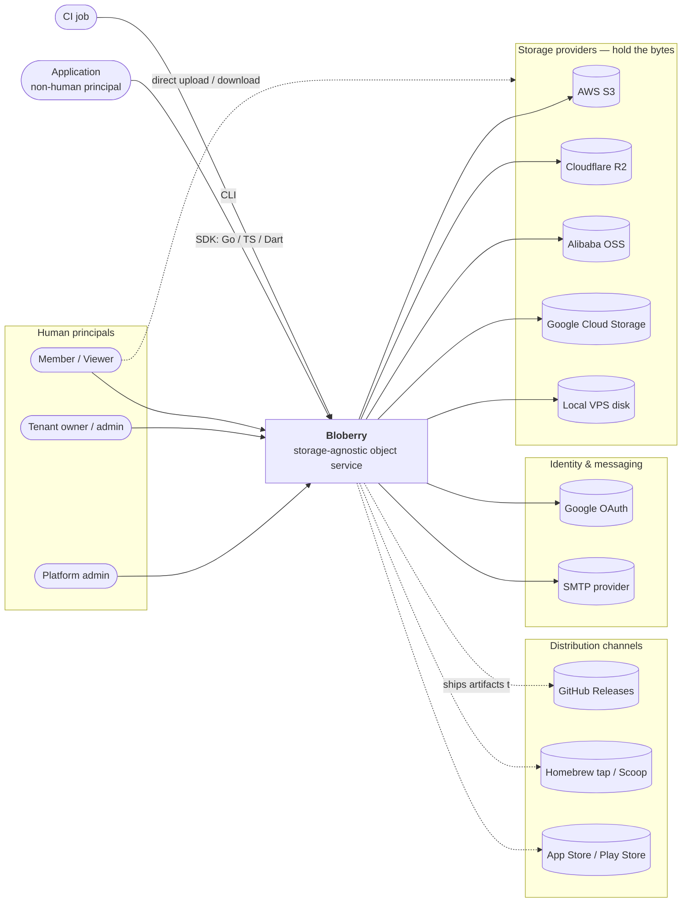

Note the dashed **member → storage** edge. It is not decoration: the default browser upload path is a presigned PUT straight to the provider, and the default private-download path is a 302 redirect to a presigned GET. Bytes routinely bypass Bloberry entirely. That is the single most important fact about this system's data path, and §3.1/§3.2 draw it out.

**Traces to:** PRD PA1–PA5, TA1–TA8, MV1–MV4, AP1–AP5, CL1–CL3.
**Contracts for these integrations** live in `TRD.md` → APIs & integrations; this section names *what* is integrated and why, not the endpoints.

---

## 2. Containers / deployables

The topology is **embedded** (`TRD.md` Stack decisions): the Vue dashboard is compiled into the Go binary. So the server side is **one deployable**, not two — and the diagram below is where that becomes visible.

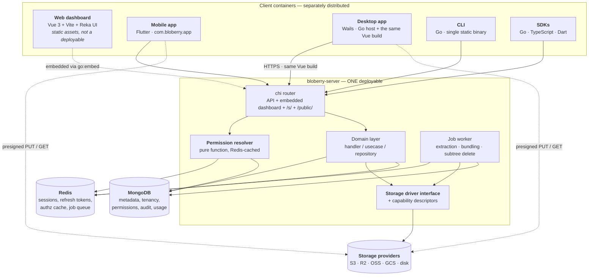

| Container | Runtime | Responsibility |
|---|---|---|
| **bloberry-server** | Go binary on the VPS (systemd) | The only server-side deployable. Serves the JSON API, the embedded dashboard, `/s/<slug>` short URLs and public object URLs; owns authorization, the storage drivers and the job worker. |
| **Web dashboard** | Static assets, compiled into the server binary | Administration UI. **Not independently deployable** — it has no server of its own. Also shipped verbatim inside the desktop app. |
| **Mobile app** | iOS / Android | Capture-and-upload and browse/share. Its own offline upload queue is the only client-side durable state in the system. |
| **Desktop app** | macOS / Windows / Linux | Wails host wrapping the *same* Vue build. Adds what a browser can't do: native drag-and-drop of folders, file dialogs, one-way folder sync, a background upload queue. Owns no durable state beyond a local sync index. |
| **CLI** | Single static binary | Scriptable path to the same API, for humans at a terminal and for CI. Second entrypoint of the same Go module — shares the API client, not a reimplementation of it. |
| **SDKs** | Consumer applications | Generated from the committed OpenAPI spec. Handle auth, retry and multipart so integrators don't. |
| **MongoDB** | VPS, native | Durable metadata only — never object bytes. Tenancy, folders, objects, grants, keys, audit, usage. |
| **Redis** | VPS, native | Ephemeral only. Sessions and refresh tokens, the resolved-permission cache, the job queue, short-URL lookups. Losing Redis logs everyone out and drops queued jobs; it must lose no durable data. |
| **Storage providers** | External | Hold every byte. Bloberry holds credentials to them but stores no object content itself. |

**One responsibility per container holds, with one deliberate exception:** `bloberry-server` runs the **job worker in-process**. That is a conscious v1 simplification (ADR-8) — extraction is CPU- and memory-heavy and will eventually want its own process — and it is called out here rather than hidden, because "one binary" is a headline goal (PRD G8) and splitting the worker later is the first thing that will break it.

---

## 3. Key end-to-end flows

Backend-internal auth sequences (signup, login, refresh, forgot-password, OTP, Google, QR pairing, config-file import) are **not** here — they belong in `backend/domains.md` and are `detail-backend`'s job. What follows are flows that genuinely cross container boundaries.

**Note on the two new auth flows (PRD M22/M23):** their *sequence* detail lives in `backend/domains.md` §4.8/§4.9, but both are cross-container in a way worth stating here. **QR pairing (M22):** the web dashboard mints a one-time Redis-backed capability token and renders it as a QR; the mobile app scans it and exchanges it for its own session (ADR-13). **Desktop config import (M23):** the web downloads a server-signed payload and encrypts it client-side with a passphrase-derived key; the desktop decrypts locally, validates signature + import window, and stores the session in the OS keychain (ADR-14). Both establish a session *as the scanned/imported user*, so both are audited (`auth.pair`, `auth.config_export`) and both sessions stay revocable via normal logout.

### 3.1 Browser upload via presigned PUT — the default write path

The core flow of the product, and the one where bytes deliberately bypass Bloberry. Traces to PRD M5, AP2, MV1, G10.

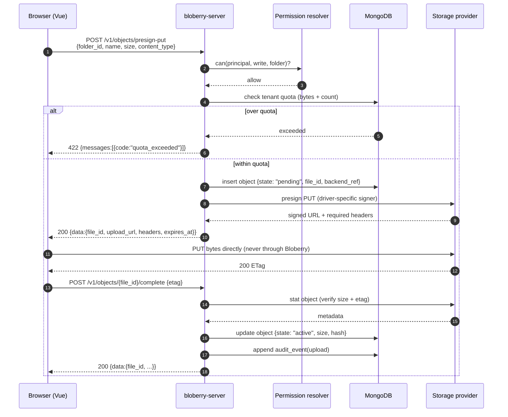

**Two things this diagram is designed to make unavoidable.** First, the object record is written **`pending` before** the bytes exist and promoted to **`active`** only after `complete` verifies them — the two-phase write from `TRD.md` R8. If the browser never calls `complete`, a reconciliation sweep hard-deletes the `pending` record and the orphaned blob past a TTL. There is no transaction across MongoDB and the provider, and pretending otherwise is how orphans accumulate silently. Second, **quota is checked before presigning, not at `complete`** — by `complete` the bytes are already stored and the check is too late to prevent anything.

### 3.2 Private download — redirect by default, proxy when forced

PRD D1. Traces to M6, M7, MV3, G1.

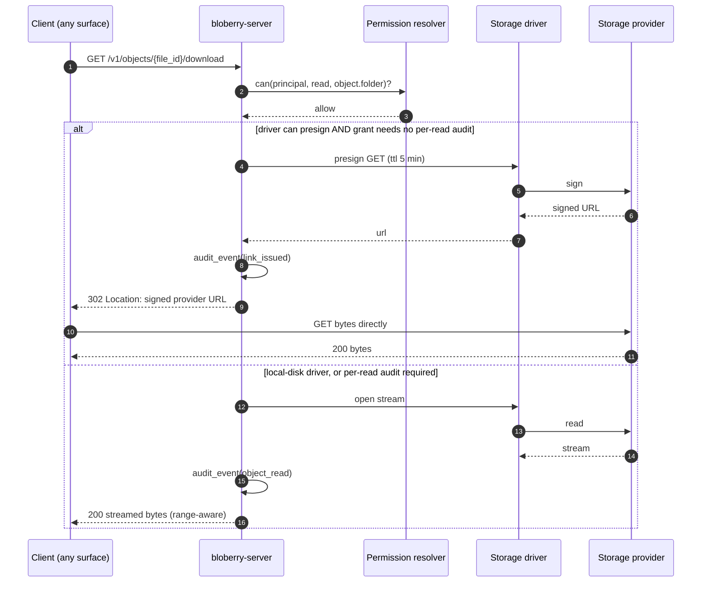

The branch is not an optimization — the **local-disk driver has no external signer at all**, so the proxy path must exist regardless. Given it exists, the same path serves grants that require every read audited. The cost, which the dashboard must state plainly: on the redirect path Bloberry records that a link was *issued*, not that bytes were *read*, and the signed URL remains valid for its TTL even if the grant is revoked one second later. Short TTLs are the mitigation; they are not a fix.

### 3.3 Public objects and short URLs

Traces to PRD M6, M8, MV2, D6. Open question **Q4** in the PRD is settled *here* in favor of redirect-with-a-caveat; §6 ADR-3 records why.

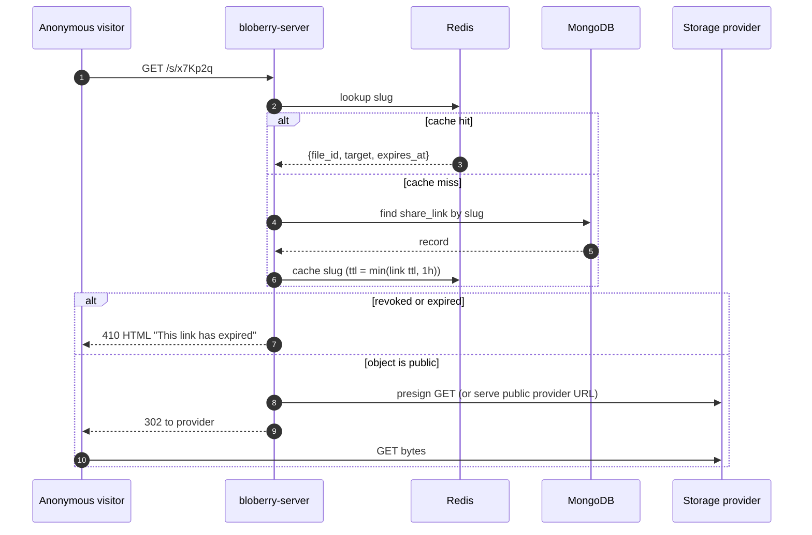

The **410 is an HTML page, not a JSON envelope** — this endpoint is reached by a human clicking a link in a chat window, not by an API client. That's PRD MV-E3, and it's the one place in the system where the standard response envelope deliberately does not apply (§5).

### 3.4 Access-key request and permission resolution

The hot path on every machine request, and the highest-risk logic in the system (PRD G5, `TRD.md` R4).

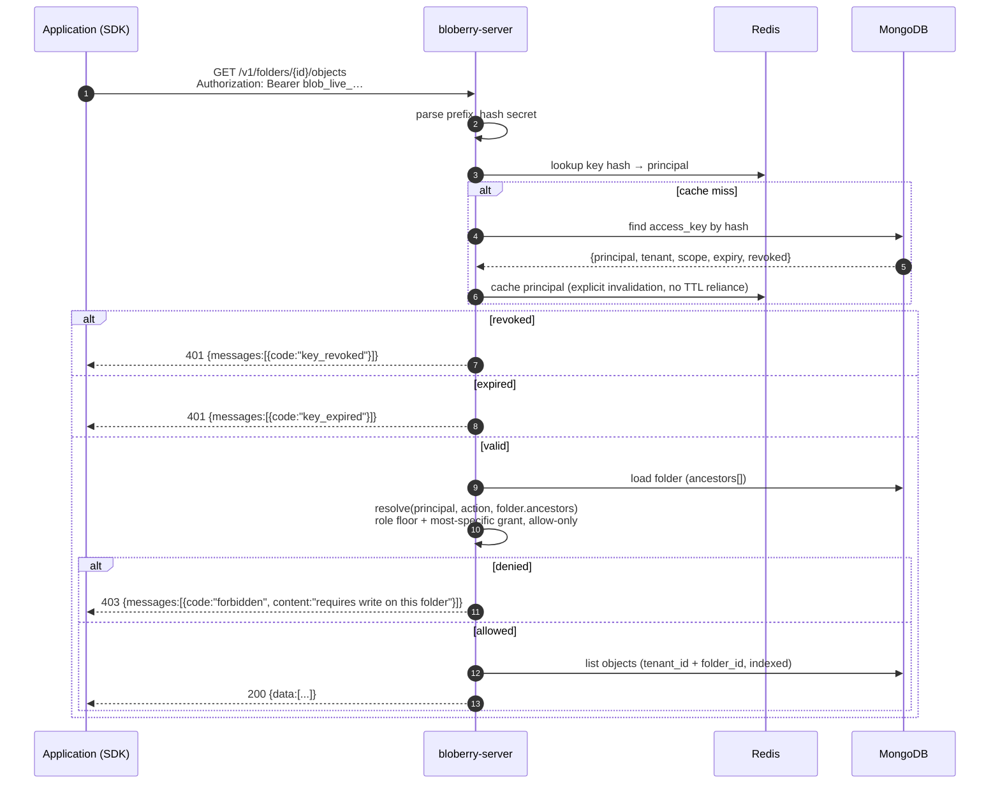

Three deliberate design points. **`key_revoked` and `key_expired` are distinct codes**, not a generic 401 — PRD AP-E1 exists because a client retrying forever against a dead credential is a real failure mode. **Revocation invalidates the cache entry explicitly** rather than waiting out a TTL, which is what makes PRD G5's "takes effect on the next request" true. And the resolver reads `folder.ancestors[]` — an indexed ID array, never a path-prefix regex (PRD D2).

### 3.5 Archive extraction — queued, never inline

Traces to PRD M11, M21, AP4, AP-E2, D3. This is also the product's most attacker-friendly surface (`TRD.md` R6).

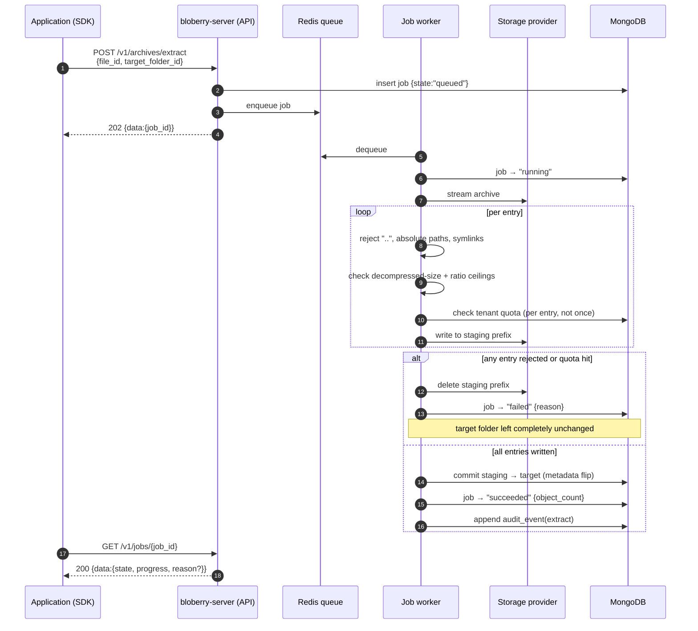

Extraction writes to a **staging prefix and commits by flipping metadata**, so a failure halfway through leaves the target folder untouched (PRD AP-E2) rather than half-populated. Quota is checked **per entry**, because a zip whose declared size passes can still expand past the ceiling.

### 3.6 Desktop one-way folder sync

The main thing the desktop shell adds over the browser (PRD S1, DT2). Traces to the `NG4` constraint that this is convenience, not backup.

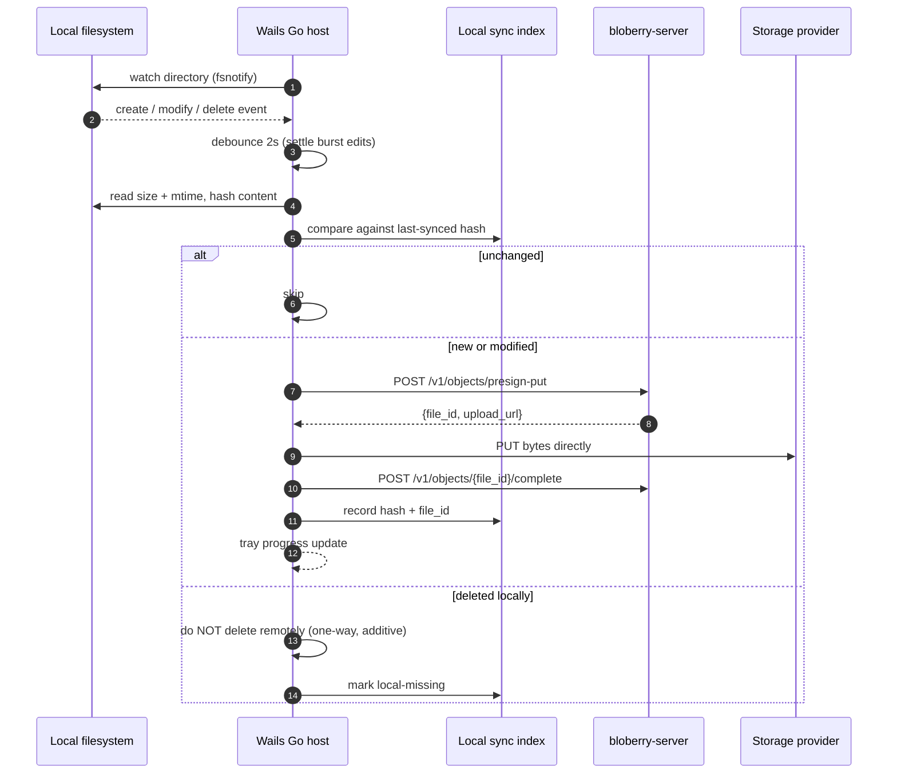

**A local delete never propagates.** Sync is one-way and additive; that is what keeps PRD NG4 honest, and the UI must say so rather than implying mirror semantics. The local sync index is a cache, never a source of truth — losing it causes a re-hash, not data loss.

### 3.7 Mobile upload queue surviving backgrounding

PRD MB2, G10 — the one piece of genuinely durable client-side state in the system.

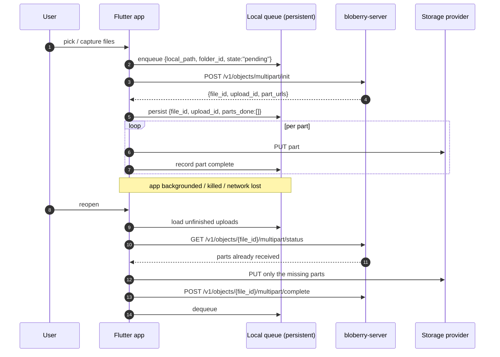

Resume works because **part state is persisted locally *and* re-verified against the server** on resume — trusting only the local record would re-upload parts the server already has, and trusting only the server would lose the mapping to the local file. Both are needed.

### 3.8 Usage metering and cost estimation

PRD M18, PA3, PA4, G7 — new in this pass, and it implies infra (`§4`) that `infra/README.md` doesn't plan yet.

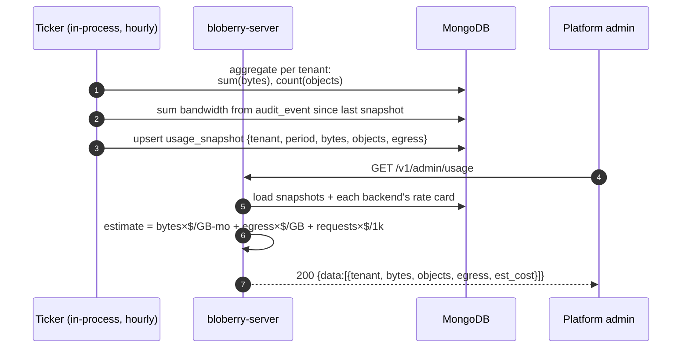

Bandwidth is derived from audit events, which means **the redirect download path (§3.2) can only attribute bytes it knows the size of** — it records the object's size at link issuance, not the actual transfer. A resumed or abandoned download will over-count. That's an accepted ±10% accuracy target (PRD G7), not a bug, and it should be labelled "estimated" in the UI.

---

## 4. Deployment topology

One VPS, one binary, two datastores. Consistent with `infra/README.md` (systemd + Caddy).

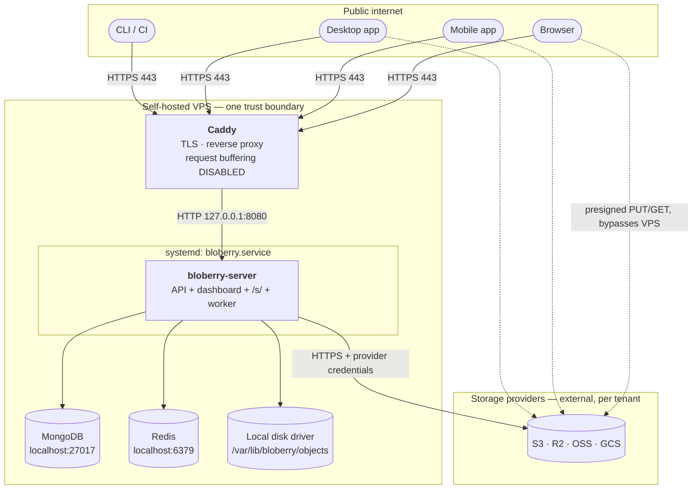

**Trust boundaries and what crosses them**

| Boundary | What crosses | Protection |
|---|---|---|
| Internet → Caddy | All client traffic | TLS terminated by Caddy (automatic certs). **Request body buffering must be explicitly disabled**, or multi-GB uploads spool to the proxy's disk (`TRD.md` R5). |
| Caddy → bloberry-server | Plain HTTP on loopback only | Never bound to a public interface. |
| bloberry-server → MongoDB / Redis | Loopback only | Not exposed. Redis holds sessions; a public Redis is a full account-takeover vector. |
| bloberry-server → providers | Provider credentials | Envelope-encrypted at rest with a key held **in the environment, never in MongoDB** (`TRD.md` R7). Decrypted in memory at driver construction only. |
| Clients ⇢ providers (dashed) | Object bytes, via presigned URLs | Bypasses the VPS entirely. Short TTLs are the only control once a URL is issued. |

**Not co-located:** the storage providers, obviously — every driver call is a network hop with real latency, which is why listing and permission checks are served from MongoDB and never by asking the provider.

**Flagged for `detail-infra` — infra this architecture implies that `infra/README.md` doesn't yet plan:**

1. **Redis** is now load-bearing for three separate things (sessions, authz cache, job queue), not just sessions. Its persistence configuration and restart behaviour need a decision — losing the queue on restart drops in-flight extraction jobs.
2. **A reconciliation sweep** (§3.1) needs to run periodically. In-process ticker or systemd timer — a decision, not an assumption.
3. **The hourly usage-metering ticker** (§3.8) is a second scheduled task with the same question.
4. **Local-disk driver storage** needs a real volume with monitored free space; filling the VPS disk takes down MongoDB and Redis with it.
5. **Envelope-encryption key rotation** is a runbook, not a code path (PRD Q3).
6. **Desktop CI needs macOS and Windows runners** — Wails cannot cross-compile, the explicit exception to the self-hosted-VPS-runner default (`TRD.md` R10).

---

## 5. Cross-cutting concerns

**Auth & session.** Two schemes resolving to one principal type, evaluated by one middleware:

- *Humans* — JWT access token (short-lived) plus an opaque refresh token in Redis. Platform-aware TTLs: long-lived on mobile, short on web. Backend-internal sequences (signup, login, refresh, logout, forgot-password, OTP, Google) live in `backend/domains.md` — **not redrawn here**.
- *Applications* — bearer access keys, prefixed `blob_live_…`, **hashed at rest**, shown exactly once (PRD D5). Scoped to a tenant and optionally to folders and permissions. The middleware is designed to admit a second scheme so HMAC signing can be added post-v1 (PRD N8) without restructuring.

Both land in the same `Principal`, which is what lets **one** permission resolver serve every request (§3.4). Getting that unification wrong is how a system ends up with two divergent authorization paths and a bug in only one of them.

**API contract.** REST/JSON with the standard envelope `{data?, messages?: [{code, content}]}`, both `omitempty`, no `error` boolean — HTTP status is the success/failure signal. Committed OpenAPI spec at `api/openapi.yaml`, versioned `/v1/` from day one, and the **single source for all three SDKs plus the CLI's client** (§7 build order). Two documented exceptions where the envelope does not apply, both because the consumer is a browser rather than an API client: `/s/<slug>` and public object URLs return HTML/redirects (§3.3).

**Error handling.** Machine-readable `code` plus human-readable `content`, always both. Codes are API — `quota_exceeded`, `key_revoked`, `key_expired`, `forbidden`, `folder_cycle`, `name_conflict` are branch points for clients, so they're documented in the OpenAPI spec, not invented per handler. **Provider errors are never passed through raw** — an S3 XML error or a GCS 403 gets translated to a Bloberry code, because leaking them exposes bucket names and credential shape. The one exception is the platform-admin backend-health view (PRD PA-E1), which deliberately shows the real provider error to whoever must fix it.

**Config & secrets.** Environment-driven, one `.env.example` per environment. Three tiers by sensitivity: ordinary config (ports, hostnames) in the environment; the **envelope-encryption key** for provider credentials in the environment and never in MongoDB; provider credentials themselves encrypted in MongoDB and decrypted only in memory. Client-side, the CLI and desktop store tokens in the **OS keychain**, never a plaintext config file; CI uses an env var instead.

**Observability.** Structured JSON logs to stdout, collected by journald. Never log: access-key secrets, presigned URLs (they *are* credentials for their TTL), or provider credentials. The audit log is a product feature (PRD M16), not observability — it's queryable by tenants and lives in MongoDB, deliberately separate from operational logging.

**Tenancy isolation.** Enforced at the **repository layer**, not by convention in handlers: every query is scoped by `tenant_id` at the point it's constructed. This is a cross-cutting concern rather than a domain rule because a single forgotten scope anywhere is a cross-tenant data leak.

---

## 6. Architecture decisions

The hard-to-reverse, system-shaping calls. Not a restatement of `TRD.md`'s Stack decisions (which language, which framework) — those are recorded there.

| # | Decision | Rationale | Alternatives rejected |
|---|---|---|---|
| **ADR-1** | **One deployable: the dashboard is compiled into the server binary** (`go:embed`). | Self-hosting in under 15 minutes (PRD G8) is a headline goal, and "deploy the API, then separately build and deploy the frontend, then configure CORS between them" is where that goal dies. One binary, one systemd unit, one Caddy site. | *Separate frontend service* — natural for Next.js, two deployables, CORS config, and a second thing a self-hoster can get wrong. *Frontend on a CDN* — adds an external dependency to a product whose selling point is self-hosting. |
| **ADR-2** | **The storage interface carries explicit capability descriptors**, rather than assuming a common denominator. | The six drivers genuinely differ: local disk has no external signer, GCS signs with a service account rather than a key pair, R2 lacks storage classes and `GetObjectAttributes`, OSS uses its own signature version, Azure Blob uses SharedKey/SAS and a container primitive. Declaring capabilities makes the differences testable; assuming them away makes them runtime failures under load. | *Lowest-common-denominator interface* — would force every driver down to what local disk can do, discarding presigned uploads, the single most valuable capability. *Per-driver branches in the usecase layer* — the leak PRD G2 exists to prevent. |
| **ADR-3** | **Downloads redirect to a provider-presigned URL by default; proxy only when the driver can't sign or the grant demands per-read audit.** | Egress is the dominant cost in object storage. Redirecting keeps Bloberry out of the data path and removes the scaling ceiling. The proxy path must exist anyway for local disk, so having both costs one branch, not one architecture. | *Always proxy* — every byte through one VPS; uniform and fully auditable, but a hard bandwidth ceiling and a cost model that punishes success. *Always redirect* — impossible for local disk, and forecloses per-read audit permanently. **Accepted cost:** on the redirect path, revocation doesn't invalidate an already-issued URL until its TTL expires. |
| **ADR-4** | **Each object records its own storage-backend pointer** rather than resolving through the tenant's current backend. | Makes "switch a tenant's backend" a safe, instant, non-destructive operation: new objects go to the new backend, existing ones keep resolving where they are. This is what lets bulk migration be deferred (PRD NG7) instead of being a prerequisite. | *Tenant-level indirection* — one field to change, but switching a backend instantly breaks every existing object until a full migration completes, making the switch a high-risk operation rather than a config change. |
| **ADR-5** | **Two-phase write (`pending` → `active`) with a reconciliation sweep**, accepting eventual consistency between MongoDB and the provider. | There is no transaction spanning a document database and a remote object store. Pretending otherwise produces silent orphans (unreferenced blobs that cost money) and broken references (metadata pointing at nothing). Naming it makes it a handled case. | *Write metadata after the byte write* — a crash then leaves a paid-for blob no one knows about, undetectable without a full bucket scan. *Distributed transaction / saga framework* — enormous machinery for a two-participant problem a state field and a sweep solve. |
| **ADR-6** | **Authorization is one pure function over `(principal, action, folder.ancestors)`, Redis-cached with explicit invalidation.** | It runs on every request and a mistake is a security bug, so it must be exhaustively testable in isolation — which means no I/O inside it. Explicit invalidation (not TTL expiry) is what makes PRD G5's "revocation takes effect on the next request" true rather than aspirational. | *Checks scattered through handlers* — the usual shape, and untestable as a whole; a missed check is invisible until exploited. *TTL-only cache* — makes revocation eventually-effective, which is not what "revoke" means to someone responding to a leak. |
| **ADR-7** | **Folder tree = materialized path + ancestor-ID array**, with permission checks and listings keyed off the indexed ID array. | Listing a directory and resolving inherited permissions are the two hottest queries; both become single indexed lookups. Subtree moves rewrite descendants but issue **zero** provider-side object copies, because objects were never addressed by path. | *Path-prefix scan* — the naive object-store approach; degrades as the tree grows and makes inherited permissions a regex problem. *Pure adjacency list* — clean writes, but resolving ancestry needs a recursive walk per authorization check, on the hot path. |
| **ADR-8** | **The job worker runs in-process in v1**, with the queue in Redis. | Preserves the one-binary story (G8). Redis is already present for sessions, so the queue costs no new infrastructure. The queue boundary means extracting the worker into its own process later is a deployment change, not a rewrite. | *Separate worker deployable* — correct at scale, but a second process and unit to operate, contradicting G8 on day one. *A real broker (NATS, RabbitMQ)* — better delivery guarantees, another service to self-host. **Accepted cost:** a CPU-heavy extraction competes with API request handling; this is the first thing to split when it hurts. |
| **ADR-9** | **The desktop app is a network client that reuses the web build verbatim** — it does not embed the server. | Removes a whole sixth UI from the plan (`TRD.md` R9's main mitigation) and keeps desktop honest as a *client*, subject to the same API and the same permissions as everything else. The Go host adds only what a browser genuinely can't do: native folder drag-drop, file dialogs, filesystem watching. | *Desktop embeds the backend* (repo-layouts shape D) — would make the desktop app a second, divergent implementation of the whole service and destroy the single-source-of-truth story. *A separate native desktop UI* — a sixth surface to design, build and keep in sync, for no user-visible gain. |
| **ADR-10** | **One Go module, four binaries** (server, CLI, desktop host, plus the Go SDK as a package), one repo including the Vue frontend and the Flutter app. | The CLI and desktop are the SDK's first consumers; sharing one module means one API client, one envelope type, one set of generated models — and a contract change breaks compilation immediately rather than silently at runtime. | *Separate repos per surface* — version skew between the server and its own CLI, and a contract change that fails at runtime in a different repo. *Separate Go modules in one repo* — the coordination cost of multi-module without the isolation benefit, at this size. |
| **ADR-11** | **Spec-first: `api/openapi.yaml` is the source, all clients are generated from it.** | Six surfaces against one contract is the plan's largest schedule risk (`TRD.md` R9). Generation makes drift a build failure instead of a support ticket, and a spec diff in CI catches a breaking change before it reaches any client. | *Hand-written SDKs* — three clients drifting in three ways, and the Dart one drifting fastest since it's internal. *Code-first generation from Go handlers* — the spec becomes a derived artifact, so a breaking change is only visible after it's been made. |
| **ADR-12** | **Redis holds only ephemeral state; MongoDB holds everything durable.** | Makes the failure mode legible: losing Redis logs everyone out and drops queued jobs — annoying, recoverable, no data loss. Nothing durable ever depends on a cache being warm. | *Redis as a primary store for hot metadata* — faster reads, but now the cache is a source of truth and a flush is data loss. |
| **ADR-13** | **Mobile QR pairing (M22) is a one-time, short-lived capability token, not a session.** The web shows a QR encoding a Redis-backed token; the mobile app scans it and exchanges it for its own session. | The token signs the phone in *as the scanned user*, so it must expire fast (~2 min) and be single-use (DEL on exchange) — a screenshot of the QR is a login credential for its TTL. The web UI states the capability nature ("this code signs you in — expires in 2 minutes"). The exchange is rate-limited per token. | *The token as a long-lived device credential* — a leaked QR becomes a permanent backdoor. *Reusing the existing device-flow (CLI) reversed* — wrong direction; the CLI flow has the *user* confirm, QR pairing has the *scan* authorize. |
| **ADR-14** | **The desktop config file (M23) is encrypted client-side with a passphrase-derived key; the server never sees the passphrase.** The web downloads a server-signed payload (an import-window claim + a refresh token) and encrypts it in the browser with an argon2id-derived AES key. Desktop import decrypts locally, validates the signature + import window, and stores the session in the keychain. | The passphrase is the file's last line of defense against an offline leak (TRD R14) — if it transited the server, a server compromise would expose it. The session inside stays a normal, revocable refresh token (DT-E2: `auth logout` on web kills the imported session). | *Server-side encryption* — the server must see the passphrase, which a compromise would leak alongside every exported file. *No encryption, just a signed bearer file* — the "encrypted" promise becomes decorative. |
| **ADR-15** | **Scale-out is the cloud-backend model, and it's a config role, not a fork.** Multi-node = more stateless API nodes + a Mongo replica set + Redis sentinel, with the job worker split into its own binary and the four tickers leader-elected via a Redis lease. The local-disk driver is single-node by design and absent from scaled installs. **Orchestration (Docker/K8s) is the recorded future, not the default** — see `infra/README.md` §3.3; the K8s stage formally ends G8's "one binary, 15 minutes" promise. | The API is already stateless (state lives in Redis/Mongo/providers), so node count scales horizontally; the only single-process assumptions are the worker (R12's documented escape hatch) and the tickers (the recorded single-instance note). One binary with a `ROLE` env var keeps the build and the 15-minute story intact for the single-node case. | *Shared-filesystem disk* — a new SPOF that defeats the driver's whole point. *A full microservice split* — unrelated isolation for a one-product store. *Staying single-node forever* — the user's stated direction is a scaled model. |

---

## 7. Implementation layout

**Layout:** **B (backend + web embedded) + F-companion (CLI) + I (desktop as a network client)** — three shapes from [`templates/repo-layouts.md`](../../templates/repo-layouts.md) composed, because this app is all three at once. It follows from `TRD.md`'s topology row (*embedded*), the CLI role (*companion*), and ADR-9 (*desktop is a client, not a shell*).

**This composition is the reason §7 matters here more than usual.** The scaffold-owner table in `repo-layouts.md` says *Desktop + web (Wails) → owner is `desktop/`* — because in that shape `wails3 init` scaffolds the whole project. **That row does not apply to Bloberry.** Here the Go module already exists (it's the server), and Wails is added as a *second binary inside it*. Running `wails3 init` would create a competing project on top of a module that already exists — precisely the failure §7 exists to prevent.

**Repos:** **one.** The server, CLI, desktop host and Go SDK share a module and a contract; the Vue frontend and the Flutter app live alongside as their own build units. A split would introduce version skew between the server and its own CLI for no isolation benefit (ADR-10).

```
bloberry/
├── .plan/                            # this entire plan folder, committed
├── go.mod                            # ONE module: github.com/<org>/bloberry
├── cmd/
│   ├── bloberry-server/main.go       ← backend/     the one server deployable
│   ├── bloberry/main.go              ← cli/         the CLI binary
│   └── bloberry-desktop/main.go      ← desktop/     Wails host (NOT a second project)
├── internal/
│   ├── auth/          {handler,usecase,repository}.go
│   ├── user/          {handler,usecase,repository}.go
│   ├── tenant/        {handler,usecase,repository}.go
│   ├── folder/        {handler,usecase,repository}.go
│   ├── object/        {handler,usecase,repository}.go
│   ├── share/         {handler,usecase,repository}.go
│   ├── apikey/        {handler,usecase,repository}.go
│   ├── grant/         {handler,usecase,repository}.go
│   ├── job/           {handler,usecase,repository,worker}.go
│   ├── usage/         {handler,usecase,repository}.go
│   ├── audit/         {handler,usecase,repository}.go
│   ├── admin/         {handler,usecase,repository}.go
│   ├── authz/         resolver.go resolver_test.go      # ADR-6, the pure function
│   ├── storage/                                          # ADR-2, the driver abstraction
│   │   ├── driver.go            # interface + capability descriptor
│   │   ├── s3/                  # serves S3 AND R2 via endpoint override
│   │   ├── oss/
│   │   ├── gcs/
│   │   ├── disk/
│   │   └── conformance/         # the one suite every driver must pass (G2)
│   ├── platform/
│   │   ├── config/  db/  redis/  httpx/  crypto/         # crypto = envelope encryption
│   │   └── web/embed.go         # //go:embed all:../../../web/dist
│   ├── cli/         {commands,output}/                   ← cli/
│   └── desktop/     {menu,tray,sync,dialogs}/            ← desktop/
├── sdk/
│   ├── go/                       # generated + hand-written upload helper
│   └── ts/                       # generated; published to npm
├── web/                          ← web/    Vue source only — never deployed alone
│   ├── src/{components,pages,stores,lib}/
│   ├── package.json              # Bun
│   └── vite.config.ts            # outDir: dist
├── mobile/                       ← mobile/ its own Flutter project, its own init
│   ├── lib/{screens,widgets,api,store}/    # api/ = the internal Dart client (PRD D8)
│   ├── android/  ios/
│   └── pubspec.yaml
├── api/openapi.yaml              # ONE spec — server, 3 SDKs, CLI all derive from it
├── migrations/                   ← ERD.md   (Mongo index + validator migrations)
├── testdata/golden/              ← cli/commands/*.md sample output blocks
├── build/                        ← desktop/ per-OS packaging (Wails)
├── deploy/                       ← infra/   systemd unit, Caddyfile, .env.example
├── .goreleaser.yaml              # CLI + Wails desktop releases
└── Makefile                      # `build` = openapi → frontend → go, in that order
```

| Plan folder | Real path | Notes |
|---|---|---|
| `backend/` | `cmd/bloberry-server/`, `internal/{auth,user,tenant,folder,object,share,apikey,grant,job,usage,audit,admin,authz,storage,platform}/`, `api/`, `migrations/` | **Owns the module.** One domain package per `internal/` directory, layered handler/usecase/repository. |
| `web/` | `web/` | Vue source only. **Not a deployable** — built to `web/dist/`, embedded by `internal/platform/web/embed.go`. |
| `cli/` | `cmd/bloberry/`, `internal/cli/`, `testdata/golden/` | **No directory of its own at the root and no init.** A second entrypoint in the same module, consuming `sdk/go`. |
| `cli/commands/` | `internal/cli/commands/` + `testdata/golden/` | Each designed command file becomes one command source file **and** its golden-output fixture. |
| `desktop/` | `cmd/bloberry-desktop/`, `internal/desktop/`, `build/` | **No separate project and no `wails3 init` in the repo.** A third entrypoint in the same module, serving `web/dist` and calling the API over HTTPS. |
| `mobile/` | `mobile/` | The one genuinely separate build unit — a Flutter project can't live inside a Go module's build. Its own `flutter create`. |
| `infra/` | `deploy/`, `.github/workflows/` | systemd unit, Caddyfile, `.env.example` per stage. |
| `design/` | *no directory* — consumed as Tailwind tokens in `web/src/lib/tokens.css` and Dart theme constants in `mobile/lib/theme/` | The style guide is a spec, not shipped code. |
| `ERD.md` | `migrations/` | Mongo index definitions and JSON-schema validators, one migration per entity group. |

**Scaffold owner:** **`backend/tasks/01-setup.md`** runs

```bash
go mod init github.com/<org>/bloberry
```

Everything else is downstream of it:

| Plan folder | Its setup task must | Init command |
|---|---|---|
| `backend/` | **Create the module.** Write the `internal/` tree, `cmd/bloberry-server/`, `api/openapi.yaml`. | `go mod init …` ✅ |
| `web/` | `Depends on: backend/tasks/01-setup.md`. Create a frontend package **inside the existing repo** at `web/`. | `bun create vite web --template vue-ts` (a package, not a repo) |
| `cli/` | `Depends on: backend/tasks/01-setup.md`. **No init.** Add `cmd/bloberry/main.go` and `internal/cli/` to the existing module. | *none* |
| `desktop/` | `Depends on: backend/tasks/01-setup.md` **and** `web/tasks/01-setup.md`. **No init — do not run `wails3 init` in this repo.** Add the Wails dependency to the existing `go.mod`, add `cmd/bloberry-desktop/main.go` and `build/`. If a Wails template is wanted as a reference, run `wails3 init` in a **scratch directory outside the repo** and port `main.go` and `build/` across. | *none* |
| `mobile/` | `Depends on: backend/tasks/01-setup.md` (for `api/openapi.yaml` only). Its own project. | `flutter create --org com.bloberry --project-name bloberry mobile` |
| `infra/` | `Depends on: backend/tasks/01-setup.md`. Add `deploy/` and workflows. | *none* |

**Build order** — three real edges, each of which fails confusingly if reversed:

1. **`api/openapi.yaml` → generated clients.** `oapi-codegen` for the server interfaces and `sdk/go`; `openapi-generator` for `sdk/ts` and `mobile/lib/api/`. Anything consuming a client must not compile before generation runs. **This is the first step of any build.**
2. **`web` build → server build.** `go build` embeds whatever sits in `web/dist/` at compile time. A backend build that runs first ships the *previous* frontend — or fails outright in CI where nothing has been built yet. One `make build` target owns both steps in order; two independent CI jobs is what causes the bug.
3. **`web` build → desktop build.** Same input, second consumer. The desktop packaging tasks depend on the same `web/dist/`.

```
openapi codegen  →  web build (bun)  →  ┬→ go build ./cmd/bloberry-server
                                        ├→ go build ./cmd/bloberry-desktop
                                        └→ go build ./cmd/bloberry   (no web dep)
```

---

## 8. Closure pass

Reconciliation against the rest of the plan, and what came out of it.

| Checked | Result |
|---|---|
| §3 flows ↔ `backend/domains.md` | Doesn't exist yet. §3 deliberately omits the auth sequences; **`detail-backend` must draw signup/login/refresh/logout/forgot-password/OTP/Google there** and adopt this file's principal model (§5) rather than inventing a second one. |
| §4 topology ↔ `infra/README.md` | Same containers and trust boundaries. **Six items flagged for `detail-infra`** (§4) — Redis persistence, the reconciliation sweep, the metering ticker, local-disk volume monitoring, encryption-key rotation, and OS-native desktop CI. `infra/README.md` already carries the last one and the Caddy no-buffering constraint. |
| §1/§2 external systems ↔ `TRD.md` → APIs & integrations | Consistent. Same **six** providers, Google OAuth, SMTP. `TRD.md` holds the contract view; this file holds the system view. No divergent second list. |
| §1/§3 ↔ `PRD.md` | Every flow traces to a listed requirement, annotated inline. **§3.8 (metering) is new since the PRD pass** and traces to M18/G7, which the PRD now carries. |
| §7 layout ↔ §2 containers ↔ `TRD.md` topology | Consistent: the tree produces exactly **one** server deployable, plus three separately-distributed client artifacts (CLI binary, desktop bundle, mobile app) and two published SDKs. The embedded topology yields no second deployable tree. Every in-scope plan folder appears in the mapping, including the three that map to "no directory of its own". |
| §6 ADRs ↔ `PRD.md` Decisions D1–D10 | ADR-3 implements D1, ADR-6 implements D7's allow-only model, ADR-9 implements D9's risk mitigation. No contradictions. |

**Resolved here, previously open:** PRD **Q4** (public objects — redirect, with the un-publish caveat stated in the UI; §3.3, ADR-3).

**No open questions remain.** The four this file flagged as owned were resolved after it was written: **Q1** (max object size → 5 GiB) and **Q2** (audit-log storage → standard collection + retention job) in `backend/domains.md` §9, **Q3** (key rotation → offline `--rotate-credential-key`) in `infra/README.md`, and **Q5** (rate limiting → in scope, keyed per access key) in `backend/domains.md` §9.

---

## Links
- Product requirements: [PRD.md](PRD.md)
- Technical requirements / risks: [TRD.md](TRD.md)
- Data model (ERD): [ERD.md](ERD.md)
- Backend domains & internal auth flows: [backend/README.md](backend/README.md)
- Web route graph: [web/navigation.md](web/navigation.md) *(written by `detail-web`)*
- Mobile route graph: [mobile/navigation.md](mobile/navigation.md) *(written by `detail-mobile`)*
- Infra / deployment detail: [infra/README.md](infra/README.md)
- Repo layout reference: [`templates/repo-layouts.md`](../../templates/repo-layouts.md)
