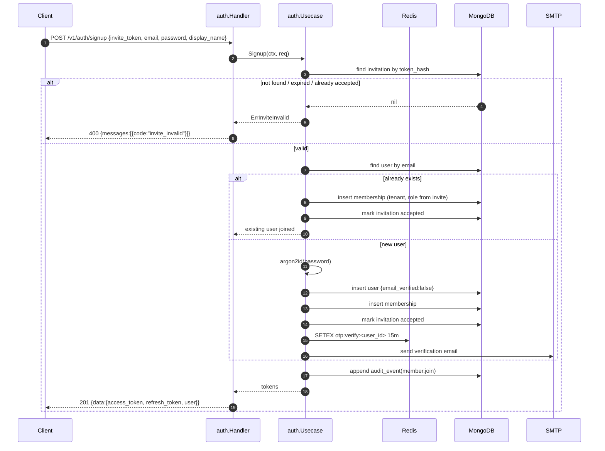
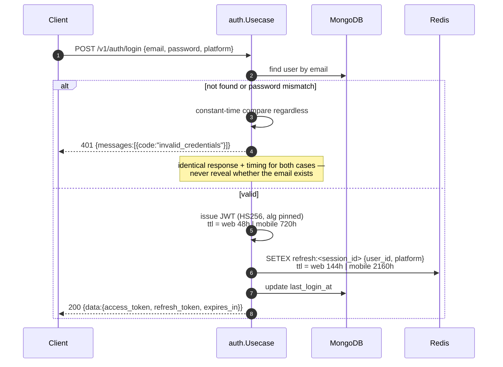
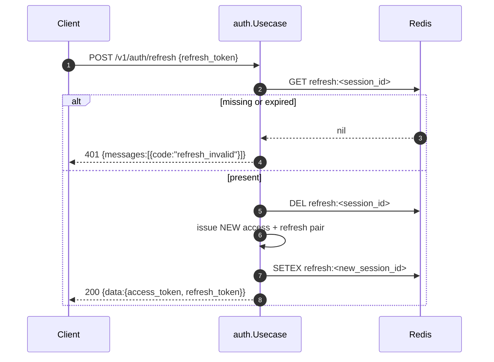
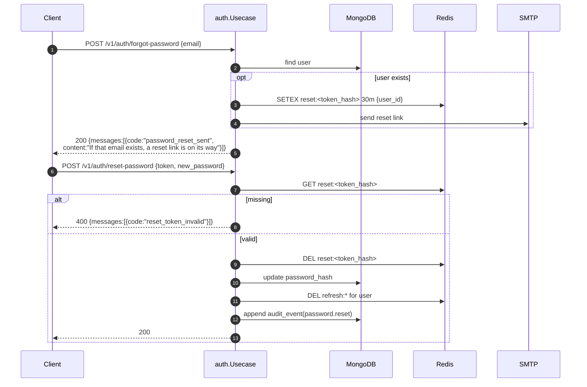
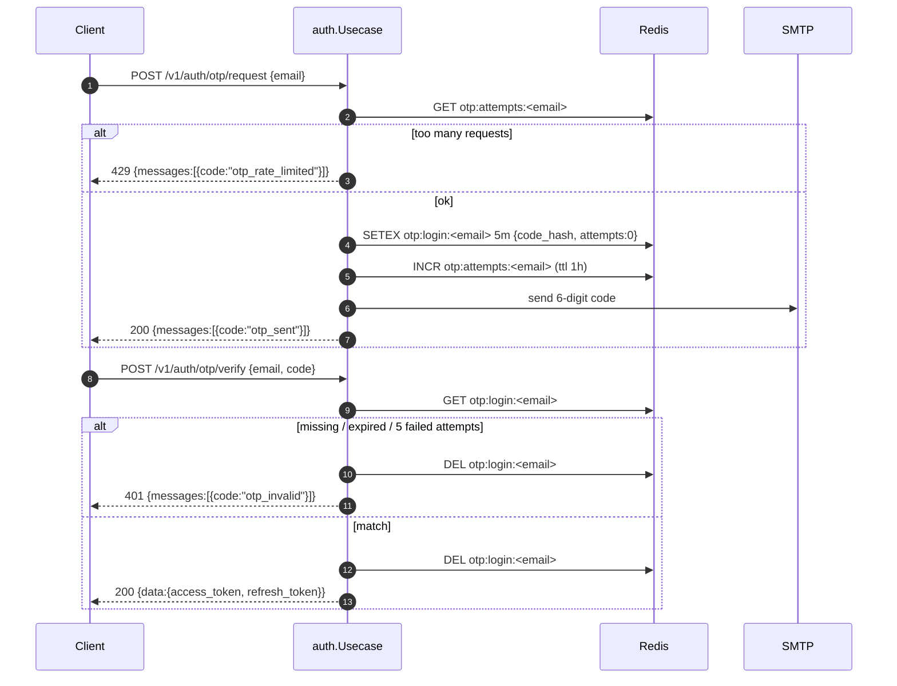
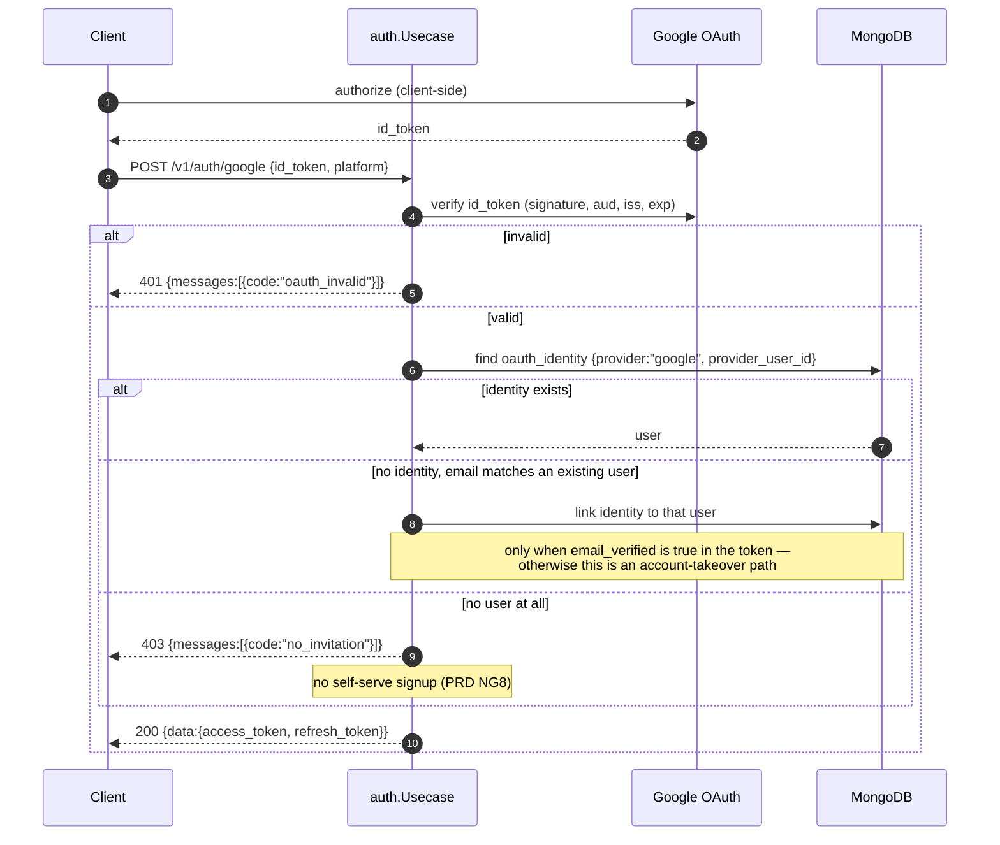
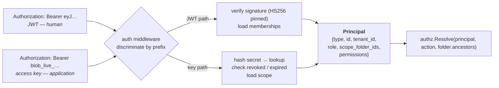
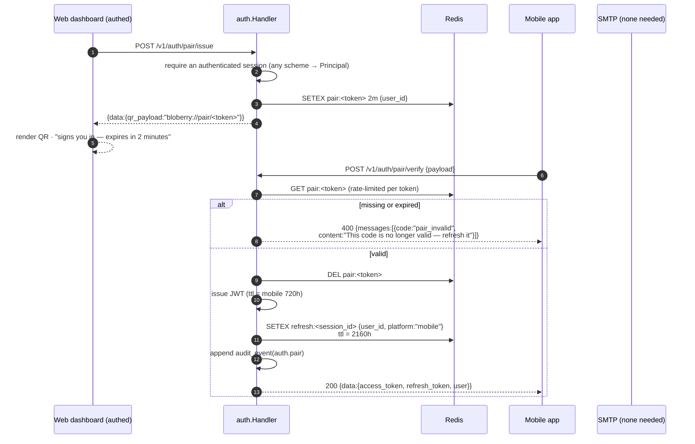
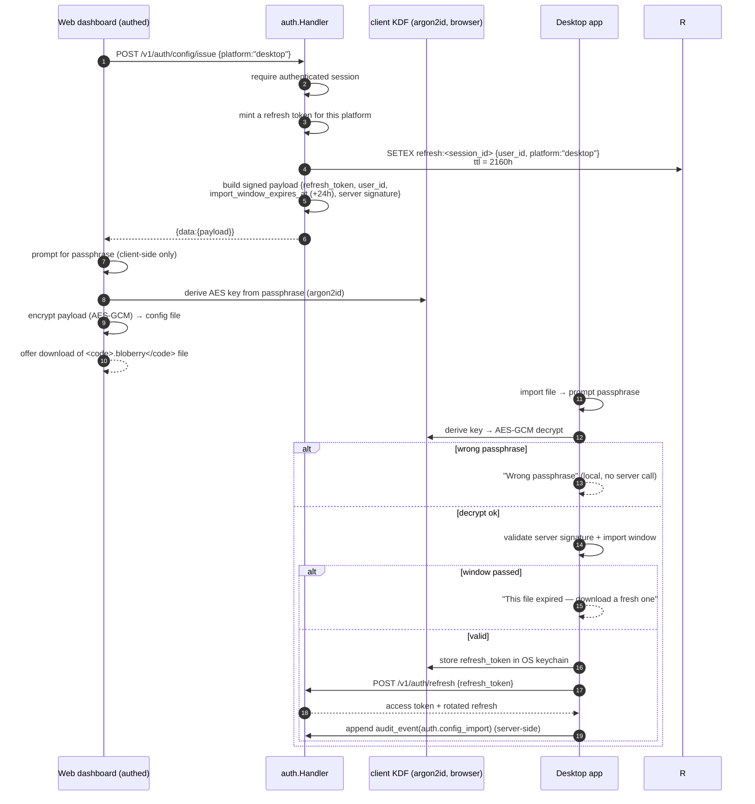

# Backend domains — Bloberry

Go + chi + MongoDB + Redis. Layered handler/usecase/repository with interface injection, per [`templates/backend-go-defaults.md`](../../../templates/backend-go-defaults.md).

**Data model:** [`../ERD.md`](../ERD.md) — the single authoritative source. Not duplicated here.
**System-level flows:** [`../architecture.md`](../architecture.md) §3 — upload, download, short URLs, extraction, sync, metering. **Not redrawn here.** This file owns the *backend-internal* flows (§4 below), primarily auth.
**Repo tree and scaffold ownership:** [`../architecture.md`](../architecture.md) §7. `backend/tasks/01-setup.md` runs the one `go mod init`.

---

## 1. Deliberate deviations from the Go defaults

Two, both consequential enough to state before anything else.

### 1.1 Spec-first OpenAPI, not code-first swaggo

`templates/backend-go-defaults.md` specifies code-first: swaggo annotations on handlers, `swag init` generating the spec. **Bloberry does the opposite** — `api/openapi.yaml` is hand-authored and is the source; `oapi-codegen` generates server interfaces and the Go SDK from it, `openapi-generator` generates the TypeScript and Dart clients.

**Why the deviation:** the defaults assume one or two first-party clients that can be fixed alongside a handler change. Bloberry has **six consumers** of one contract — web, mobile, desktop, CLI, and two published SDKs (`TRD.md` R9). With code-first, a breaking change is only visible *after* it's been made, and it reaches published SDKs before anyone notices. With spec-first, the spec diff is a reviewable artifact and CI can fail on a breaking change before any client sees it (ADR-11).

**What this costs:** writing the spec by hand is slower than annotating handlers, and the spec can drift from the implementation if generation isn't enforced. Mitigation: `make generate` regenerates server interfaces from the spec, and CI fails if the working tree changes — so an implementation that doesn't match the spec doesn't compile.

**Kept from the defaults regardless:** the committed-spec-as-contract principle, the response envelope, snake_case JSON, and the requirement that mobile/web/CLI all consume the same file.

### 1.2 Roles are per-tenant, not a global array on the user

The defaults suggest `roles: []string` on the user document for MongoDB. Bloberry can't use that: a user may be `tenant_admin` in one tenant and `viewer` in another. Roles live on `memberships` (`ERD.md`), and the single global role — `platform_admin` — is a nullable field on `users`.

Role checks stay in the **usecase layer** per the defaults. The folder-grant layer on top is `internal/authz/` (§5), which is deliberately *not* per-domain, because it must behave identically everywhere.

---

## 2. Domain structure

One package per `internal/` directory, each with the standard five files:

```
internal/<domain>/
├── repository.go             # package <domain> — type Repository interface
├── usecase.go                # package <domain> — type Usecase interface
├── repository/repository.go  # package repository — Mongo implementation
├── usecase/usecase.go        # package usecase — business logic
└── handler/handler.go        # package handler — Handler interface + impl
```

Interfaces named plainly `Repository`, `Usecase`, `Handler` — referenced as `folder.Repository`, `object.Usecase`. Constructors take the interface below, never a concrete type. Compile-time assertions (`var _ folder.Usecase = (*usecase)(nil)`) in every implementation.

| # | Domain | Owns | Depends on (via its own narrow interfaces) |
|---|---|---|---|
| 1 | **`auth`** | Signup, login, refresh, logout, forgot-password, OTP login, Google OAuth, invitation acceptance, **QR pairing issue/verify (M22)**, **config-file issue/import validation (M23)**, **TOTP provision/enable/verify + backup codes + admin reset (M24)** | `user.Reader`, Redis, mailer |
| 2 | **`user`** | Profile, settings, password change | — |
| 3 | **`tenant`** | Tenant CRUD, quota, members, invitations, backend assignment | `user.Reader`, `usage.Reader` |
| 4 | **`folder`** | Tree CRUD, move, subtree delete, listing, cycle prevention | `authz.Resolver`, `job.Enqueuer` |
| 5 | **`object`** | The `file_id` lifecycle: presign, direct upload, multipart, complete, stat, move, rename, delete, visibility | `storage.Registry`, `authz.Resolver`, `tenant.QuotaChecker`, `folder.Reader` |
| 6 | **`share`** | Signed links, short URLs, resolution, revocation | `object.Reader`, `storage.Registry` |
| 7 | **`apikey`** | Applications, access-key issue/list/revoke, principal resolution | `authz.Invalidator` |
| 8 | **`grant`** | Folder grants: create, list, revoke | `authz.Invalidator`, `folder.Reader` |
| 9 | **`job`** | Queue, worker, status. Kinds: extract, bundle, subtree_delete | `storage.Registry`, `object.Writer`, `folder.Writer` |
| 10 | **`usage`** | Hourly metering, cost estimation from rate cards | `tenant.Reader` |
| 11 | **`audit`** | Append-only event write and query | — |
| 12 | **`admin`** | Storage-backend registration, rate cards, health checks, install stats | `storage.Registry`, `usage.Reader`, `tenant.Reader` |

**Two packages that are deliberately not domains** — they have no HTTP surface of their own and are consumed by nearly every domain:

- **`internal/authz/`** — the permission resolver (§5). A pure function plus its cache. Not a domain because it has no endpoints and no repository of its own; it reads through `grant.Repository` and `apikey.Repository`.
- **`internal/storage/`** — the driver abstraction (§6). Not a domain for the same reason: it's infrastructure the `object`, `share` and `job` domains call.

**Cross-domain dependencies are inverted** per the defaults: `object` doesn't import `tenant.Usecase`, it defines `object.QuotaChecker` with exactly the one method it needs, satisfied by `tenant`'s usecase at wiring time. This keeps the dependency graph a DAG — worth enforcing, because `object` → `tenant` → `usage` → `tenant` is an easy cycle to create accidentally.

---

## 3. Concrete folder tree

Expands [`../architecture.md`](../architecture.md) §7 for the backend specifically. Real names, not placeholders.

```
cmd/bloberry-server/main.go        # wiring only: config → db → repos → usecases → handlers → router

internal/
├── auth/          repository.go usecase.go repository/ usecase/ handler/
├── user/          …
├── tenant/        …
├── folder/        …
├── object/        …
├── share/         …
├── apikey/        …
├── grant/         …
├── job/           repository.go usecase.go repository/ usecase/ handler/ worker/
├── usage/         …
├── audit/         …
├── admin/         …
│
├── authz/                          # NOT a domain — no endpoints
│   ├── resolver.go                 # the pure function (§5)
│   ├── resolver_test.go            # table-driven, 100% branch coverage (PRD G5)
│   ├── cache.go                    # Redis, explicit invalidation
│   └── principal.go                # the unified Principal type (§5.1)
│
├── storage/                        # NOT a domain — infrastructure
│   ├── driver.go                   # Driver interface + Capabilities (§6)
│   ├── registry.go                 # backend_id → constructed Driver, credential decryption
│   ├── s3/driver.go                # serves S3, R2, MinIO, B2, Spaces, Wasabi
│   ├── oss/driver.go
│   ├── gcs/driver.go
│   ├── disk/driver.go              # + its own HMAC presigner (§6.3)
│   └── conformance/suite.go        # the one suite every driver must pass (PRD G2)
│
└── platform/
    ├── config/    config.go env.go
    ├── db/        mongo.go migrate.go indexes.go
    ├── redis/     client.go
    ├── httpx/     envelope.go errors.go middleware.go stream.go
    ├── crypto/    envelope.go       # credential envelope encryption (TRD R7)
    └── web/       embed.go          # //go:embed all:../../../web/dist

api/openapi.yaml                    # the source of truth (§1.1)
migrations/                         # Mongo index + validator migrations, per ERD.md
```

---

## 4. Backend-internal flows

The flows `architecture.md` deliberately left to this file. **App-specific multi-container flows are not repeated here** — see `architecture.md` §3.

### 4.1 Signup (email/password) with invitation

No self-serve signup in v1 (PRD NG8) — every account originates from an invitation or a platform admin.



An invitation for an **existing** email adds a membership rather than erroring — a user legitimately belongs to several tenants, and treating that as a duplicate-account conflict is a common and annoying bug.

### 4.2 Login, with platform-aware token issue



`platform` comes from the client and defaults to mobile when absent. Web gets short-lived tokens (shared/public machines); mobile gets long-lived ones (a device the user owns). Per the defaults: `JWT_WEB_ACCESS_TTL=48h`, `JWT_WEB_REFRESH_TTL=144h`, `JWT_MOB_ACCESS_TTL=720h`, `JWT_MOB_REFRESH_TTL=2160h`.

**Algorithm pinning is non-negotiable** (defaults → Auth): construct the parser with `jwt.NewParser(jwt.WithValidMethods([]string{"HS256"}))`, and assert `*jwt.SigningMethodHMAC` inside the keyfunc as well. No code path anywhere accepts `alg: none`, including in tests.

### 4.3 Refresh with rotation



**Rotation, not renewal** — the old refresh token is deleted, bounding the blast radius of a leak. A refresh token presented twice fails the second time, which is also the signal that one has been stolen.

### 4.4 Forgot password



Two things worth being deliberate about: the response is **identical whether or not the email exists** (otherwise this endpoint is an account-enumeration oracle), and a successful reset **invalidates every existing session** — someone resetting a password after a compromise expects exactly that.

### 4.5 OTP login



The OTP is **hashed in Redis**, attempt-capped at 5, and rate-limited per email — a 6-digit code with unlimited attempts is a 10⁶ brute force that succeeds in minutes.

### 4.6 Google login



Auto-linking a Google identity to an existing email-password account **only when Google asserts the email is verified** — otherwise anyone who can create a Google account with someone's address takes over their Bloberry account.

### 4.7 The two auth schemes converging on one principal

The reason authorization can be one function (§5), drawn once here because it's the seam between `auth`, `apikey` and `authz`:



Everything downstream sees a `Principal` and nothing else. **No handler ever branches on which scheme was used** — that's what prevents the classic failure of two authorization paths where only one gets a fix.

### 4.8 Mobile QR pairing login (PRD M22, ADR-13)

A **capability token**, one-time and ~2 min TTL — whoever holds it can log the phone in as the scanned user. The web dashboard mints it from the user's *existing* session; the mobile app exchanges it for its own session.



The **rate limit is per token** — a 2-minute one-time token can't be meaningfully brute-forced, but the verify endpoint is still token-bucket-capped so a flood of invalid payloads can't burn CPU. The token is **never the session**: it's a single-use minting ticket.

### 4.9 Desktop encrypted config import (PRD M23, ADR-14)

The server **never sees the passphrase**. Web downloads a server-signed payload; encryption happens in the browser with an argon2id-derived key. Desktop decrypts locally, validates signature + import window, stores the session in the keychain.



**The import window is a property of the signed payload** — after 24h the file is dead even un-imported, and the refresh token inside expires on its own TTL regardless. **Revocability is inherited**: the session is an ordinary refresh token, so `auth logout` on web (or any device) kills the imported session too (PRD DT-E2, G5).

### 4.10 TOTP two-factor authentication (PRD M24)

Gates **every human login** — password, email-OTP and Google all end with a TOTP check once `users.totp.enabled` (`ERD.md`). Access keys are exempt (already scoped capabilities). Two halves: provisioning and verification.

```mermaid
sequenceDiagram
  autonumber
  participant U as User (web)
  participant H as auth.Handler
  participant C as crypto (envelope key)
  participant M as MongoDB

  Note over U,H: ENABLE
  U->>H: POST /v1/auth/totp/provision
  H->>H: generate TOTP secret (RFC 6238, 30s, 6 digits)
  H->>C: encrypt secret (envelope key, R7)
  H->>M: save users.totp = {secret_encrypted, enabled:false}
  H-->>U: {data:{otpauth_url, secret}}  # secret shown EXACTLY once (MV-E5)
  U->>U: scan QR in authenticator app
  U->>H: POST /v1/auth/totp/enable {code}
  H->>M: verify code against secret (current ±1 window)
  alt code ok
    H->>M: users.totp.enabled = true; generate 10 backup codes (hashed, argon2id)
    H-->>U: {data:{backup_codes:[…]}}  # shown once, single-use
  else code wrong
    H-->>U: 400 {messages:[{code:"totp_invalid"}]}
  end

  Note over U,H: LOGIN (any human scheme — password, OTP, Google)
  U->>H: POST /v1/auth/login {…}
  H->>M: verify primary factor (existing §4.2/§4.5/§4.6)
  alt users.totp.enabled
    H-->>U: 401 {messages:[{code:"totp_required"}]}   # NO session issued yet
    U->>H: POST /v1/auth/login/verify-totp {pending, code|backup_code}
    alt TOTP valid
      H->>H: issue session (mobile/web TTL)
    else backup code valid
      H->>M: mark that backup code used (single-use)
      H->>H: issue session
    else neither
      H-->>U: 401 {messages:[{code:"totp_invalid"}]}  # attempt-capped
    end
  else totp disabled
    H->>H: issue session directly
  end
```

**The `pending` token is the key detail** — the primary factor is verified first, but the session isn't issued until the TOTP step passes; a short-lived Redis `totp:pending:<user_id>` bridges the two steps so the TOTP verify is rate-limited per user without re-running the primary factor. **Recovery** (MV-E4, R15): backup codes, single-use and hashed; the platform-admin reset (`admin` action, audited `auth.totp_reset`) is the only other path — never self-serve, so a compromised email can't bypass 2FA.

---

## 5. The permission resolver

`internal/authz/`. The highest-risk code in the system (`TRD.md` R4, PRD G5, ADR-6).

### 5.1 The Principal

```go
type PrincipalType string // "user" | "application"

type Principal struct {
    Type            PrincipalType
    ID              string
    TenantID        string
    Role            Role        // tenant_owner | tenant_admin | member | viewer | ""
    IsPlatformAdmin bool
    ScopeFolderIDs  []string    // empty = whole tenant (access keys only)
    KeyPermissions  []Permission // empty = no key-level narrowing
    Grants          []Grant     // pre-loaded, non-revoked, non-expired
}
```

### 5.2 The function

```go
// Pure. No I/O. Everything it needs is already in Principal and ancestors.
func Resolve(p Principal, action Permission, folderID string, ancestors []string) Decision
```

Order of evaluation, and each step's reason for existing:

1. **Platform admin** → allow. Runs the install; deliberately above tenancy.
2. **Tenant mismatch** → deny. The isolation boundary, checked before anything else can grant.
3. **Key scope** (applications only) — if `ScopeFolderIDs` is non-empty and neither `folderID` nor any entry in `ancestors` appears in it → deny. **A key can only ever narrow, never widen.**
4. **Key permissions** — if `KeyPermissions` is non-empty and doesn't include `action` → deny. Same rule: narrowing only.
5. **Role floor** — `tenant_owner`/`tenant_admin` get all actions; `member` gets read+write+share; `viewer` gets read.
6. **Grants** — take the grant whose `folder_id` is `folderID` or the **deepest** entry in `ancestors`. If it includes `action`, allow. Grants only add.
7. Otherwise → deny.

**There is no deny rule** (PRD D7). Absence of permission is the default; nothing overrides an allow. This is what keeps the function exhaustively testable — the state space is bounded and every path is reachable from a table.

### 5.3 Caching

`Principal` assembly (steps that need MongoDB — memberships, key lookup, grants) is cached in Redis keyed by principal ID. `Resolve` itself is never cached; it's pure and fast, and caching decisions per `(principal, action, folder)` would multiply the invalidation surface.

**Invalidation is explicit, never TTL-based.** Key revoke, grant create/revoke, membership change and role change all delete the principal's cache entry synchronously. A TTL would make PRD G5's "revocation takes effect on the next request" false, which matters most in exactly the situation revocation exists for.

### 5.4 Testing

Table-driven, **100% branch coverage required** (PRD G5) — enforced in CI, not aspirational. The table must cover, at minimum: each role × each action; platform admin crossing tenants; a key scoped to a subtree accessing its own folder, a descendant, an ancestor, and a sibling; a key whose permissions are narrower than its role; an expired grant; a revoked grant; nested grants at two depths where the deeper one wins; and a grant on a folder that is *not* an ancestor of the target.

---

## 6. The storage driver abstraction

`internal/storage/`. The thing the product exists to provide (`TRD.md` R1/R2, PRD G1/G2, ADR-2).

### 6.1 The interface

```go
type Driver interface {
    Capabilities() Capabilities

    Put(ctx context.Context, key string, r io.Reader, size int64, contentType string) error
    Get(ctx context.Context, key string, rng *Range) (io.ReadCloser, *ObjectInfo, error)
    Delete(ctx context.Context, keys []string) error
    Stat(ctx context.Context, key string) (*ObjectInfo, error)

    PresignGet(ctx context.Context, key string, ttl time.Duration) (*PresignedURL, error)
    PresignPut(ctx context.Context, key string, ttl time.Duration, size int64) (*PresignedURL, error)

    MultipartInit(ctx context.Context, key string, contentType string) (uploadID string, err error)
    MultipartPresignPart(ctx context.Context, key, uploadID string, part int, ttl time.Duration) (*PresignedURL, error)
    MultipartComplete(ctx context.Context, key, uploadID string, parts []Part) (*ObjectInfo, error)
    MultipartAbort(ctx context.Context, key, uploadID string) error

    HealthCheck(ctx context.Context) error
}

type Capabilities struct {
    Presign            bool  // false for disk without Bloberry's own signer
    Multipart          bool
    MinPartSize        int64 // S3 5MiB, others differ
    MaxPartCount       int
    StorageClasses     bool  // false on R2
    ServerSideCopy     bool
    RangeRequests      bool
    ObjectAttributes   bool  // false on R2 — no GetObjectAttributes
}
```

**`Capabilities` is a stored, asserted value, not an inferred one.** It lives on the `storage_backends` document (`ERD.md`) and the conformance suite asserts against it. R2 being "S3 with a different endpoint" is exactly the assumption that produces failures only under multipart, only at scale (`TRD.md` R2).

### 6.2 The interface is designed against the hardest driver

Per `TRD.md` R1: **local disk** for presigning (no external signer at all) and **GCS** for credentials (service-account signer, not a static key pair). Designing against S3 first and retrofitting the others is how the abstraction leaks.

| Driver | Serves | Presign mechanism | Notable divergence |
|---|---|---|---|---|
| `s3` | AWS S3, MinIO, Backblaze B2, DigitalOcean Spaces, Wasabi | SigV4, static key pair | The reference implementation |
| `r2` | Cloudflare R2 | SigV4 against the **account-scoped** endpoint | No storage classes, no `GetObjectAttributes`, different multipart part-size behavior |
| `oss` | Alibaba OSS | OSS's own signature version | Separate SDK entirely; different error shapes |
| `gcs` | Google Cloud Storage | **Service-account signer**, or IAM `signBlob` when running without a key file | Credential shape differs fundamentally from the other three |
| `azblob` | Azure Blob Storage | **SharedKey or SAS token** (or AAD via the SDK); container-scoped | Separate SDK (`azblob`), container-vs-bucket primitive, block-blob staging for multipart — a genuinely different model, not an S3 endpoint override |
| `disk` | Local VPS volume | **Bloberry-issued HMAC token** against its own `/v1/objects/{id}/raw` endpoint | `Capabilities.Presign` is true only because Bloberry implements the signer itself |

### 6.3 The disk driver's presigner

Worth stating separately because it's the case that shapes the interface. There is no provider to sign a URL, so the disk driver issues an HMAC token — `HMAC(secret, key + expiry + method)` — against a Bloberry endpoint that verifies it and streams the file with range support. It is a proxy wearing a presign interface. That's deliberate: it means the `object` domain calls `PresignGet` unconditionally and never branches on driver type, which is precisely PRD G2.

### 6.4 The conformance suite

`internal/storage/conformance/` — one suite, run against every driver. This is how PRD G2 is verified rather than asserted.

Covers: round-trip put/get/stat/delete; range requests; presigned PUT and GET actually working from an external HTTP client; multipart across the driver's declared minimum part size; multipart abort leaving nothing behind; overwriting an existing key; deleting a nonexistent key (must not error); listing correctness; and **capability honesty** — every capability declared `true` is exercised, and every one declared `false` is asserted to fail in the documented way.

Run against MinIO locally (fast, no credentials) and against real S3, R2, OSS, GCS and Azure Blob in CI on a schedule — not on every push, since it costs money and needs real credentials.

---

## 7. Session store, tokens and TTLs

**Redis**, per the repo default. Rejected the Mongo-backed alternative the defaults mention: Bloberry already runs Redis for the authz cache and job queue, and the refresh-token audit trail that Mongo storage would buy is already covered by `audit_events` (`ERD.md`).

| Key | Value | TTL |
|---|---|---|
| `refresh:<session_id>` | `{user_id, platform, issued_at}` | web 144h / mobile 2160h |
| `pair:<token>` | `{user_id}` — **one-time QR pairing ticket (M22)** | 2m, DEL on use |
| `totp:pending:<user_id>` | `{attempts}` — bridges primary factor → TOTP verify (M24) | 5m, DEL on session issue |
| `otp:login:<email>` | `{code_hash, attempts}` | 5m |
| `otp:attempts:<email>` | counter | 1h |
| `reset:<token_hash>` | `{user_id}` | 30m |
| `principal:<type>:<id>` | resolved Principal (§5.3) | **no TTL** — explicitly invalidated |
| `apikey:<secret_hash>` | `{principal_id, tenant_id}` | **no TTL** — explicitly invalidated |
| `slug:<slug>` | `{file_id, target, expires_at}` | min(link TTL, 1h) |
| `job:queue` | list | — |

**Losing Redis** logs everyone out, drops queued jobs, and cold-starts the authz cache. It loses **no durable data** (ADR-12) — a property worth preserving deliberately, since it's what makes Redis operationally boring.

---

## 8. Error codes

Codes are API — clients branch on them (PRD AP-E1), so they're defined in `api/openapi.yaml` and never invented per handler. Once shipped, a code never changes meaning.

| Code | Status | Meaning |
|---|---|---|
| `invalid_credentials` | 401 | Login failed. Identical for wrong password and unknown email. |
| `refresh_invalid` | 401 | Refresh token missing, expired, or already rotated. |
| `key_revoked` | 401 | Access key was revoked. **Terminal — do not retry.** |
| `key_expired` | 401 | Access key past its expiry. **Terminal — do not retry.** |
| `otp_invalid` | 401 | Wrong, expired, or too many attempts. |
| `otp_rate_limited` | 429 | Too many OTP requests for this email. |
| `oauth_invalid` | 401 | Google id_token failed verification. |
| `pair_invalid` | 400 | QR pairing token missing, expired, or already used (M22) — "This code is no longer valid — refresh it". |
| `config_invalid` | 400 | Config file's server signature invalid or tampered (M23). |
| `config_expired` | 400 | Config file's import window has passed (M23) — "download a fresh one". |
| `totp_required` | 401 | Human login succeeded on the primary factor but TOTP is enabled — a code (or backup code) is needed before a session is issued (M24). |
| `totp_invalid` | 401 | Wrong TOTP code or used backup code — attempt-capped per pending token. |
| `no_invitation` | 403 | Valid identity, but no account — no self-serve signup (NG8). |
| `forbidden` | 403 | Authorization denied. `content` names what was needed. |
| `quota_exceeded` | 422 | Tenant over byte or object quota. Writes rejected, reads unaffected. |
| `name_conflict` | 409 | An object/folder of that name exists. Client chooses replace/keep-both/cancel. |
| `folder_cycle` | 422 | Move would place a folder inside its own descendant. |
| `object_pending` | 409 | Object exists but its upload was never completed. |
| `backend_unreachable` | 502 | Storage provider failed. Real provider error is **admin-only**. |
| `archive_rejected` | 422 | Zip bomb, path traversal, symlink, or ratio ceiling hit. |
| `link_expired` | 410 | Share link expired or revoked. **HTML, not JSON**, for `/s/` (§4 note). |
| `payload_too_large` | 413 | Over the max object size (Q1). |

**Provider errors are never passed through raw.** An S3 XML error leaks bucket names and credential shape. The single exception is `admin`'s backend-health view, where the real error goes to the person who has to fix it (PRD PA-E1).

---

## 9. Resolved open questions

Carried from `ERD.md` and `PRD.md`.

| # | Question | Decision |
|---|---|---|
| **ERD-Q1 / PRD-Q1** | Maximum single-object size | **5 GiB** committed for v1, enforced at presign time. Multipart part size **16 MiB** default, scaled up so no upload exceeds 10,000 parts (S3's ceiling). 5 GiB is comfortably below every driver's own limit, keeps part counts small, and matches PRD G10's stated test. Raising it later is a config change; lowering it would break clients. |
| **ERD-Q2 / PRD-Q2** | `audit_events` storage | **A standard collection** with `{tenant_id, created_at:-1}`, plus a monthly retention job hard-deleting past a configurable window (default 365 days). *Rejected:* a capped collection — it can't be queried by tenant efficiently and evicts globally, so a busy tenant would silently erase a quiet tenant's history. *Rejected for now:* a time-series collection — a genuinely better fit for the write pattern, but its restrictions on secondary indexes and deletes complicate the `{tenant_id, target_type, target_id}` query that PRD TA6 needs. Revisit at v1.1 if write volume demands it. |
| **ERD-Q3** | Does dedup (PRD S3) share a blob or copy? | **Copy in v1; sharing deferred.** Sharing requires a `blobs` collection with reference counting, and until refcounting is correct **no delete can be trusted** — deleting one object would silently destroy another's bytes. That is too much risk for a Should-priority feature. Recorded honestly: adding sharing later is a **migration**, not a feature flag, because `objects.storage_key` would move behind a `blob_id`. |
| **PRD-Q5** | Per-tenant API rate limiting | **In scope, in `platform/httpx/middleware.go`.** Shared infrastructure means one misbehaving application degrades every other tenant. Token bucket in Redis, keyed per **access key** (not per tenant) so one bad integration doesn't throttle its tenant's dashboard. Returns 429 with `Retry-After`. Default limits are config, not hardcoded. |

---

## 10. Guards

- **`make lint`** — `golangci-lint` with `.golangci.yml` pinning at minimum: `errcheck`, `gosec`, `gocritic`, `revive`, `govet`, `staticcheck`, `unused`, `ineffassign`.
- **`make security`** — `gosec` standalone, as its own gate. Specific things it must stay green on here: pinned JWT algorithm (§4.2), no hardcoded credentials, no unhandled `io.Copy` errors on the streaming paths, and no path traversal in the disk driver or the extraction worker.
- **`make mocks`** — `mockgen` auto-discovering `handler.go`/`usecase.go`/`repository.go`. The uniform interface naming (§2) is what lets one invocation cover every domain; don't rename an interface for clarity.
- **`make generate`** — `oapi-codegen` from `api/openapi.yaml`. **CI fails if this dirties the working tree**, which is what keeps spec-first honest (§1.1).
- **Coverage gate** — `internal/authz/` requires 100% branch coverage (PRD G5). Everything else has no hard gate; one function does, because one function is the security boundary.

---

## Links

- Data model: [`../ERD.md`](../ERD.md)
- System architecture and multi-container flows: [`../architecture.md`](../architecture.md)
- Product requirements: [`../PRD.md`](../PRD.md)
- Technical risks: [`../TRD.md`](../TRD.md)
- Go conventions: [`templates/backend-go-defaults.md`](../../../templates/backend-go-defaults.md)
