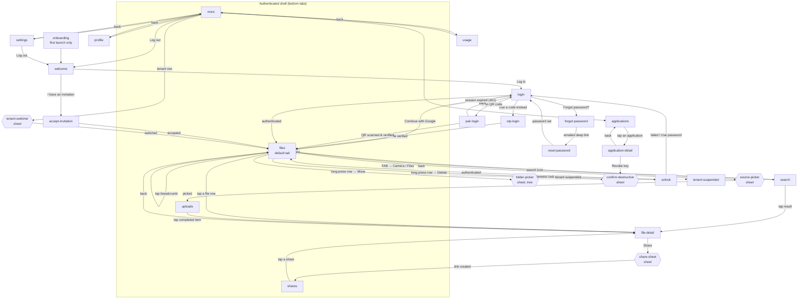

# Navigation — Bloberry (mobile)

The **single authoritative route graph** for the Flutter app. Every mockup's entry/exit prose must agree with this file; where they disagree, this file wins. `generate-mockups` validates the two against each other.

Deliberately **not** shared with `web/navigation.md`. Mobile is a capture-and-check surface, not a second dashboard (`mobile/README.md`) — it has fewer destinations, a different shell, and different gating.

---

## Shell

**Bottom tab bar, 4 tabs**, `size.navbar-height` 64px:

| Tab | Route | Why it's a tab |
|---|---|---|
| **Files** | `files` | The default landing destination. The reason the app exists. |
| **Uploads** | `uploads` | Uploads are long-running and survive backgrounding (PRD MB2) — they need a permanent home, not a transient sheet. This is the tab most other apps get wrong by hiding the queue. |
| **Shares** | `shares` | Sharing from a phone is a primary use case (PRD MV2). |
| **More** | `more` | Everything administrative. Deliberately a menu, not three more tabs. |

**Why four and not five:** the administrative surfaces (usage, applications, keys) are occasional-use — a tenant admin checking quota or revoking a leaked key away from a laptop. Promoting any of them to a tab would push a rarely-used destination in front of the three that matter daily.

**Default after login:** `files` at the tenant root.
**Unauthenticated:** `welcome`, or `onboarding` on genuine first launch (a persisted flag, shown once ever).
**Tenant switcher** lives in the app bar on `files` and at the top of `more` — not in a tab.

---

## Graph

---

## Routes

| Route name | Path | Args | Presentation | Back goes to | Auth |
|---|---|---|---|---|---|
| `onboarding` | `/onboarding` | — | replace | (exits app) | public |
| `welcome` | `/welcome` | — | replace | (exits app) | public |
| `login` | `/login` | — | push | `welcome` | public |
| `otp-login` | `/login/otp` | `email: String?` | push | `login` | public |
| `pair-login` | `/login/pair` | — | push (camera overlay) | `login` | public |
| `forgot-password` | `/forgot-password` | — | push | `login` | public |
| `reset-password` | `/reset-password` | `token: String` | replace (deep link) | `login` | public |
| `accept-invitation` | `/invite/:token` | `token: String` | replace (deep link) | `welcome` | public |
| `unlock` | `/unlock` | — | replace (over shell) | (exits app) | session held |
| `files` | `/files/:folderId?` | `folderId: String?` — null = tenant root | tab (default) | parent folder, then exits | required |
| `file-detail` | `/files/detail/:fileId` | `fileId: String` | push | `files` at the file's folder | required |
| `search` | `/search` | `q: String?` | push | `files` | required |
| `uploads` | `/uploads` | — | tab | (exits app) | required |
| `shares` | `/shares` | — | tab | (exits app) | required |
| `more` | `/more` | — | tab | (exits app) | required |
| `profile` | `/profile` | — | push | `more` | required |
| `settings` | `/settings` | — | push | `more` | required |
| `usage` | `/usage` | — | push | `more` | `tenant_admin`+ |
| `applications` | `/applications` | — | push | `more` | `tenant_admin`+ |
| `application-detail` | `/applications/:appId` | `appId: String` | push | `applications` | `tenant_admin`+ |
| `tenant-suspended` | `/suspended` | — | replace | (exits app) | required |

**21 routes.** All get a mockup except `tenant-suspended`, which is a single-state page and gets one anyway — so **21 mobile mockups**.

---

## Deliberately sheets, not screens

Modal bottom sheets with no route. Listed so nobody builds them as screens and so the closure pass doesn't flag them as missing:

| Sheet | Opened from | Why not a screen |
|---|---|---|
| `source-picker` | `files` FAB | Two choices (Camera / Files). A whole screen for two buttons is friction. |
| `share-sheet` | `file-detail` | Transient; the result lands in `shares`. |
| `folder-picker` | `files` long-press → Move | **The only place a folder tree appears on mobile**, same as web's move-picker (`web/navigation.md`). Disables the moved node and its descendants as targets. |
| `confirm-destructive` | delete, revoke | Shared component; typed-name confirmation for irreversible actions. |
| `tenant-switcher` | `files` app bar, `more` header | Switching **always lands on `files` at the new tenant's root** — a `folderId` from one tenant is meaningless in another. |

---

## Required screens — reconciled against the PRD

`templates/flutter-defaults.md` requires six screens by default. Bloberry has five of them, and the sixth is deliberately absent:

| Required | Status |
|---|---|
| Onboarding | ✅ `onboarding` — three panes explaining folders, sharing and access keys. Shown once, flag persisted. |
| Welcome | ✅ `welcome` |
| **Signup** | ❌ **Deliberately absent.** PRD NG8: no self-serve signup in v1 — accounts arrive by invitation or platform-admin creation. `accept-invitation` fills its place in the graph. If self-serve signup is ever added (a SaaS pivot), this is the screen that appears. |
| Login | ✅ `login`, plus `otp-login` and Google |
| Profile / Account | ✅ `profile` |
| Settings | ✅ `settings` — includes the PIN/biometric unlock toggle |

---

## Flow chains

**Capture and upload**
`files` → FAB → `source-picker` → camera or file picker (OS) → returns to `uploads` with items queued → per-file progress → complete.
*Permission denied (camera/photos)* → inline explanation with a "Open Settings" action, not a dead end.
*App backgrounded mid-upload* → upload continues where the platform allows; on resume, `uploads` reconciles against `GET /v1/objects/:id/multipart/status` and re-sends only missing parts (PRD MB2, `architecture.md` §3.7).
*Offline* → items stay queued with an "Waiting for connection" state; the queue is persisted, so killing the app doesn't lose them.
*Quota exceeded* → that item fails with the real reason; the rest continue (PRD MV-E1).

**Share from a phone**
`files` → tap file → `file-detail` → Share → `share-sheet` → pick signed link + TTL, or short URL, or make public → created → OS share sheet opens with the URL pre-filled.
*Cancel* → back to `file-detail`, nothing created.
*Make public* → `confirm-destructive` first; public is effectively irreversible once the URL has been copied (`TRD.md` R11).

**Biometric unlock**
App resumed after the configured timeout → `unlock` over the shell → biometric prompt.
*Success* → returns to exactly where the user was, not to `files`.
*Failure / unavailable* → "Use password" → `login`.
*Toggle lives in* `settings`, off by default.

**Session expiry**
Any route → 401 → `login`, preserving the intended destination and returning to it after login.
*Queued uploads survive* — they're presigned and go straight to the provider; only their `complete` call waits for re-login.

**Revoke a key from a phone** (the "urgent, away from a laptop" case)
`more` → `applications` → `application-detail` → key row → Revoke → `confirm-destructive` showing **when it was last used** (PRD TA-E3) → revoked.
*No Undo* — key revocation is irreversible and the toast deliberately offers none (`design/style-guide.md`).

---

## Auth gating summary

| Gate | Routes |
|---|---|
| public | `onboarding`, `welcome`, `login`, `otp-login`, `pair-login`, `forgot-password`, `reset-password`, `accept-invitation` |
| session held, locked | `unlock` |
| any authenticated | `files`, `file-detail`, `search`, `uploads`, `shares`, `more`, `profile`, `settings`, `tenant-suspended` |
| `tenant_admin` or `tenant_owner` | `usage`, `applications`, `application-detail` |

Platform-admin surfaces (`admin-tenants`, `admin-backends`, `admin-usage`) are **web-only** — registering a storage backend involves pasting credentials and is not a phone task. Stated here so their absence reads as a decision rather than an omission.

A `viewer` on `files` sees write actions **disabled with a reason**, not hidden (PRD MV4).
