# Navigation — Bloberry (web)

The **single authoritative route graph** for the web dashboard. Every mockup's entry/exit prose must agree with this file; where they disagree, this file wins and the mockup gets corrected. `generate-mockups` validates the two against each other.

The Wails desktop app loads this same route graph unchanged (`architecture.md` ADR-9) — desktop adds native chrome around it, not different routes.

---

## Shell

**Authenticated shell: a left sidebar** (`size.sidebar-width` 260px, collapsing to `size.navrail-width` 72px), per `design-collection/web-screen/patterns.md`. Not a top nav: the section list is long enough that horizontal space would run out, and the sidebar carries the tenant switcher, which needs to be visible at all times in a multi-tenant product.

```
┌─ Tenant switcher ──────────┐   ← current tenant + switch; the single most
│                            │      dangerous thing to get wrong in the UI
├─ WORKSPACE ────────────────┤
│  Files            (default)│
│  Shares                    │
│  Jobs                      │
├─ ADMINISTRATION ───────────┤   ← tenant_admin and tenant_owner only
│  Applications              │
│  Members                   │
│  Audit log                 │
│  Usage                     │
│  Settings                  │
├─ PLATFORM ─────────────────┤   ← platform_admin only; visually separated
│  Tenants                   │      because it crosses the tenancy boundary
│  Storage backends          │
│  Install usage             │
└─ User menu (bottom) ───────┘   ← profile, account settings, log out
```

**Default landing after login:** `files` at the tenant root.
**Unauthenticated users** get `login`. Any authenticated route hit without a session redirects to `login` with a `?next=` param, and returns there after login — losing someone's destination on session expiry is a small thing that feels broken every time.

**Section visibility is role-driven, and hidden ≠ protected.** The ADMINISTRATION group is hidden for `member`/`viewer` and the PLATFORM group for everyone but `platform_admin`, but every route is independently guarded server-side. Hiding is a courtesy; the guard is the control.

**Mobile width (< 768px):** the sidebar becomes a drawer behind a hamburger. There is no bottom tab bar — this is an admin interface, and its sections don't reduce to four tabs honestly.

---

## Graph

```mermaid
flowchart TD
    subgraph Public["Public (no session)"]
        Login["login"]
        Otp["otp-login"]
        Forgot["forgot-password"]
        Reset["reset-password"]
        Invite["accept-invitation"]
        Expired["link-expired"]
    end

    Login -->|"Log in"| Files
    Login -->|"Use a code instead"| Otp
    Login -->|"Forgot password?"| Forgot
    Login -->|"Continue with Google"| Files
    Otp -->|"code verified"| Files
    Forgot -->|"emailed link"| Reset
    Reset -->|"password set"| Login
    Invite -->|"accept + set password"| Files
    Invite -->|"already have an account"| Login

    subgraph Shell["Authenticated shell (sidebar)"]
        direction TB
        Files["files<br/><i>default</i>"]
        Shares["shares"]
        Jobs["jobs"]
        Apps["applications"]
        Members["members"]
        Audit["audit"]
        Usage["usage"]
        TSettings["tenant-settings"]
        AdminTenants["admin-tenants"]
        AdminBackends["admin-backends"]
        AdminUsage["admin-usage"]
    end

    Files -->|"click a folder row"| Files
    Files -->|"breadcrumb segment"| Files
    Files -->|"click a file row"| FileDetail["file-detail"]
    Files -->|"Share action"| ShareDialog{{"share-dialog<br/><i>modal</i>"}}
    Files -->|"Permissions action"| GrantDialog{{"grant-dialog<br/><i>modal</i>"}}
    Files -->|"Move action"| MoveDialog{{"move-picker<br/><i>modal, tree</i>"}}
    Files -->|"Delete folder"| ConfirmDialog{{"confirm-destructive<br/><i>modal</i>"}}
    Files -->|"extract / bundle started"| Jobs
    Files -->|"quota exceeded → see usage"| Usage

    FileDetail -->|"back / breadcrumb"| Files
    FileDetail -->|"Share"| ShareDialog
    FileDetail -->|"see raw events"| Audit
    ShareDialog -->|"created"| Shares
    Shares -->|"click linked file"| FileDetail
    Shares -->|"Share action"| ShareDialog

    Apps -->|"click an application"| AppDetail["application-detail"]
    AppDetail -->|"Create key"| KeyDialog{{"key-created<br/><i>modal, shown once</i>"}}
    AppDetail -->|"Revoke key"| ConfirmDialog
    AppDetail -->|"back"| Apps
    Jobs -->|"view target folder"| Files

    Members -->|"Invite"| InviteDialog{{"invite-member<br/><i>modal</i>"}}
    Members -->|"Remove member"| ConfirmDialog

    TSettings -->|"Change storage backend"| ConfirmDialog
    Usage -->|"see raw events"| Audit

    AdminTenants -->|"click a tenant"| AdminTenantDetail["admin-tenant-detail"]
    AdminTenantDetail -->|"back"| AdminTenants
    AdminBackends -->|"click a backend"| AdminBackendDetail["admin-backend-detail"]
    AdminBackendDetail -->|"back"| AdminBackends
    AdminUsage -->|"click a tenant row"| AdminTenantDetail

    Shell -->|"user menu → Profile"| Profile["profile"]
    Shell -->|"user menu → Account"| Account["account-settings"]
    Shell -->|"user menu → Pair a device"| PairDevice["pair-device"]
    Profile -->|"back"| Files
    Account -->|"back"| Files
    PairDevice -->|"back"| Files

    Shell -->|"user menu → Log out"| Login
    Shell -.->|"session expired (401)"| Login
    Shell -.->|"tenant suspended"| Suspended["tenant-suspended"]
    Shell -.->|"403 on a guarded route"| Forbidden["forbidden"]
    Shell -.->|"unknown path"| NotFound["not-found"]

    Forbidden -->|"back to Files"| Files
    NotFound -->|"back to Files"| Files
```



---

## Routes

| Route name | Path | Args | Presentation | Back goes to | Auth |
|---|---|---|---|---|---|
| `login` | `/login` | `?next: string?` | replace | (exits) | public |
| `otp-login` | `/login/otp` | — | push | `login` | public |
| `forgot-password` | `/forgot-password` | — | push | `login` | public |
| `reset-password` | `/reset-password` | `token: string` (query) | replace | `login` | public |
| `accept-invitation` | `/invite/:token` | `token: string` | replace | (exits) | public |
| `link-expired` | `/s/:slug` *(410 render)* | `slug: string` | replace | (exits) | public |
| `files` | `/files/:folderId?` | `folderId: string?` — absent = tenant root | sidebar (default) | parent folder, then (exits) | required |
| `file-detail` | `/files/detail/:fileId` | `fileId: string` | push | `files` at the file's folder | required |
| `shares` | `/shares` | `?status: active\|expired\|revoked` | sidebar | (exits) | required |
| `jobs` | `/jobs` | `?state: …` | sidebar | (exits) | required |
| `applications` | `/applications` | — | sidebar | (exits) | `tenant_admin`+ |
| `application-detail` | `/applications/:appId` | `appId: string` | push | `applications` | `tenant_admin`+ |
| `members` | `/members` | — | sidebar | (exits) | `tenant_admin`+ |
| `audit` | `/audit` | `?from,to,action,principal` | sidebar | (exits) | `tenant_admin`+ |
| `usage` | `/usage` | `?period: string?` | sidebar | (exits) | `tenant_admin`+ |
| `tenant-settings` | `/settings/tenant` | — | sidebar | (exits) | `tenant_owner` |
| `profile` | `/profile` | — | push | previous | required |
| `account-settings` | `/settings/account` | — | push | previous | required |
| `pair-device` | `/settings/pair` | — | push | previous | required |
| `admin-tenants` | `/admin/tenants` | — | sidebar | (exits) | `platform_admin` |
| `admin-tenant-detail` | `/admin/tenants/:tenantId` | `tenantId: string` | push | `admin-tenants` | `platform_admin` |
| `admin-backends` | `/admin/backends` | — | sidebar | (exits) | `platform_admin` |
| `admin-backend-detail` | `/admin/backends/:backendId` | `backendId: string` | push | `admin-backends` | `platform_admin` |
| `admin-usage` | `/admin/usage` | `?period: string?` | sidebar | (exits) | `platform_admin` |
| `tenant-suspended` | `/suspended` | — | replace | (exits) | required |
| `forbidden` | `/403` | — | replace | `files` | required |
| `not-found` | `/*` | — | replace | `files` | any |

**27 routes, all of which get a mockup** (the two single-state pages — `link-expired` and `not-found` — get one anyway). Confirmed against the graph in `generate-mockups`' closure pass.

---

## Deliberately dialogs, not routes

These are modals with no URL of their own. Listed explicitly so nobody builds them as pages, and so the closure pass doesn't flag them as missing routes:

| Dialog | Opened from | Why not a route |
|---|---|---|
| `share-dialog` | `files` row action, `file-detail`, `shares` (+ Share) | Transient; the result (a link) is what persists, and it lands in `shares`. |
| `grant-dialog` | `files` folder row action | Operates on the row behind it; losing that context to a full page navigation makes it harder to use. |
| `move-picker` | `files` row action (file or folder) | **The one place a folder tree still appears** — see the note below. |
| `key-created` | `application-detail` after issuing a key | Shows the secret **exactly once** (PRD M10, D5). Must be a modal precisely because it's un-returnable-to: a route would be re-navigable and re-shareable. |
| `invite-member` | `members` | Short form, no deep-link value. |
| `confirm-destructive` | Folder delete, key revoke, member removal, backend change | One shared component (`web/components.md`), typed-name confirmation for irreversible actions. |
| `upload-queue` | Global, docked bottom-right | Persists **across navigation** — this is exactly why it can't be a route. |

### The folder tree's one remaining home

The file browser is **breadcrumbs + table, no persistent tree pane** (decided in `detail-web`). The folder tree component therefore survives in exactly one place: the `move-picker` dialog, where you genuinely must see the destination hierarchy to pick a target.

`design/style-guide.md` defines a Folder tree component and a `size.tree-width` token sized for a persistent pane. **Both are rescoped to the move-picker dialog** — noted here because a token defined for a pane that no longer exists is exactly how a stale style guide misleads a builder later.

---

## Flow chains

The multi-step journeys, with their cancel and failure landings — the edges most often missed.

**Upload**
`files` → drop or press Upload → `upload-queue` opens (docked, no navigation) → per-file progress → complete.
*Name collision* → inline replace/keep-both/cancel per file, queue stays open (PRD MV-E2).
*Quota exceeded* → that file fails with `quota_exceeded`, others continue (PRD MV-E1); queue shows a link to `usage`.
*Navigate away mid-upload* → queue persists; uploads continue.
*Close the browser tab* → presigned uploads die. A warning `beforeunload` fires while any upload is in flight.

**Share a file**
`files` or `file-detail` → `share-dialog` → choose signed-link + TTL, or short URL, or make public → created → toast with a copy button → link appears in `shares`.
*Cancel* → back to the originating page, nothing created.
*Make public* → `confirm-destructive` variant first, because public is irreversible in effect if the URL has been copied (`architecture.md` ADR-3, `TRD.md` R11).

**Issue an access key**
`applications` → `application-detail` → Create key → scope form (folders + permissions + expiry) → `key-created` modal showing the secret **once** → close → key appears masked in the list, forever.
*Close without copying* → the secret is unrecoverable. The modal says so before it can be dismissed, and dismissal requires an explicit acknowledgement rather than a stray click on the backdrop.

**Extract an archive**
`files` → row action Extract → target-folder confirm → 202 → toast "Extraction queued" linking to `jobs` → `jobs` shows progress.
*Failure* → job row shows the real reason; **the target folder is unchanged** (PRD AP-E2).

**Delete a large folder**
`files` → folder row action Delete → `confirm-destructive` stating the **real object count** → if above threshold, becomes a job → toast links to `jobs`.
*Cancel* → nothing happens. Typed-name confirmation required (PRD TA-E1).

**Session expiry**
Any route → 401 on any request → redirect to `login?next=<current path>` → after login, return there.
*In-flight uploads* survive (they're presigned, going straight to the provider), but the `complete` call will fail until re-login — the queue shows them as retryable rather than failed.

**Tenant switch**
Any route → tenant switcher → **always lands on `files` at the new tenant's root**, never the equivalent path in the new tenant. A `folderId` from tenant A is meaningless in tenant B, and silently 404-ing (or worse, resolving) is the kind of bug multi-tenant UIs get wrong.

**Pair a mobile device (QR)**
user menu → `pair-device` → QR renders (one-time token, ~2 min TTL) with the capability warning → phone scans in the mobile app → mobile session established → QR shows "paired" and dies. *Refresh* → new token (the old one is dead even if unscanned). *Expired* → auto-refresh with a notice. See `backend/domains.md` §4.8.

**Export a desktop login file**
user menu → `pair-device` → config-file card → passphrase (min strength, client-side only) → download `.bloberry` file (signed, encrypted, 24h import window) → desktop imports it. *Wrong passphrase at import* → "wrong passphrase" (never transits the server). *Window passed* → "download a fresh one". The imported session stays revocable via `auth logout`. See `backend/domains.md` §4.9.

---

## Auth gating summary

| Gate | Routes |
|---|---|
| public | `login`, `otp-login`, `forgot-password`, `reset-password`, `accept-invitation`, `link-expired`, `not-found` |
| any authenticated | `files`, `file-detail`, `shares`, `jobs`, `profile`, `account-settings`, `pair-device`, `forbidden`, `tenant-suspended` |
| `tenant_admin` or `tenant_owner` | `applications`, `application-detail`, `members`, `audit`, `usage` |
| `tenant_owner` only | `tenant-settings` |
| `platform_admin` only | `admin-tenants`, `admin-tenant-detail`, `admin-backends`, `admin-backend-detail`, `admin-usage` |

A `viewer` reaching `files` sees the same page with write actions **disabled and explained**, not hidden and not an error wall (PRD MV4, `design/style-guide.md` → Permission-denied state).
